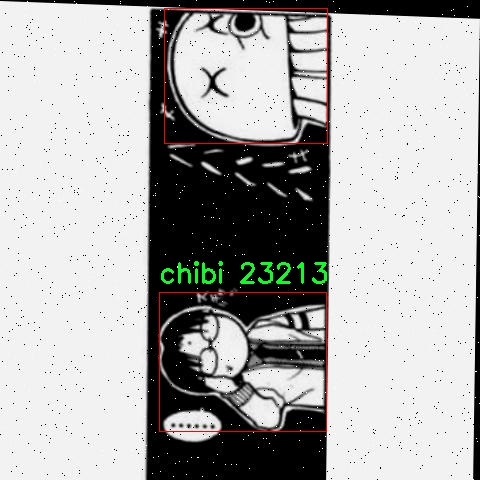
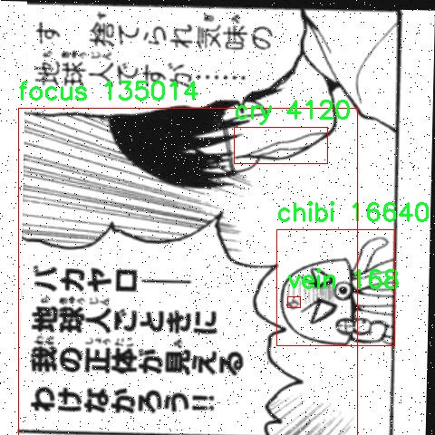
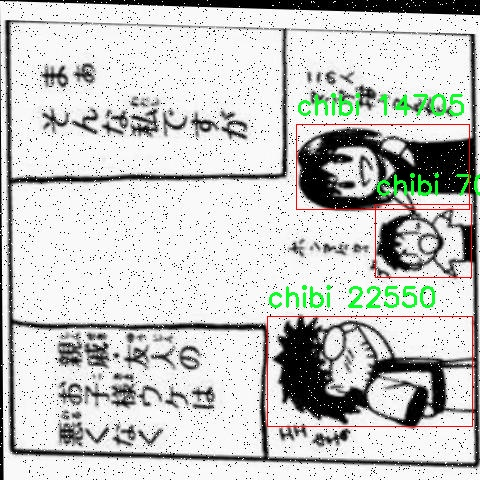

# 漫画元素检测检测系统源码分享
 # [一条龙教学YOLOV8标注好的数据集一键训练_70+全套改进创新点发刊_Web前端展示]

### 1.研究背景与意义

项目参考[AAAI Association for the Advancement of Artificial Intelligence](https://gitee.com/qunshansj/projects)

项目来源[AACV Association for the Advancement of Computer Vision](https://gitee.com/qunmasj/projects)

研究背景与意义

随着数字化时代的到来，漫画作为一种独特的艺术形式，逐渐在全球范围内获得了广泛的关注和喜爱。漫画不仅仅是一种娱乐媒介，更是文化表达的重要载体，承载着丰富的情感和社会价值。尤其是在日本，漫画产业的发展已成为其文化软实力的重要组成部分。随着漫画创作和消费的不断增加，如何高效地分析和理解漫画中的元素，成为了学术界和产业界亟待解决的问题。

在漫画创作中，特定的视觉元素如“chibi”（迷你角色）、“cry”（哭泣）、“focus”（聚焦）、“kimono”（和服）、“movement”（动作）和“vein”（血管）等，承载着丰富的情感和叙事信息。这些元素不仅影响着漫画的视觉效果，也直接关系到读者的情感共鸣和理解。因此，开发一个能够自动检测和识别这些漫画元素的系统，具有重要的学术价值和实际意义。

近年来，深度学习技术的快速发展为图像识别和目标检测提供了新的机遇。YOLO（You Only Look Once）系列模型因其高效的实时检测能力而广泛应用于各类视觉任务中。YOLOv8作为该系列的最新版本，进一步提升了检测精度和速度，为漫画元素的自动识别提供了强有力的技术支持。然而，传统的YOLOv8模型在处理特定领域（如漫画）时，可能面临特征提取不足和类别适应性差的问题。因此，基于改进YOLOv8的漫画元素检测系统的研究，旨在通过优化模型结构和训练策略，提高对漫画特有元素的检测能力。

本研究的意义不仅在于推动漫画元素检测技术的发展，更在于为漫画创作者和研究者提供一种新的工具和方法。通过自动化的元素检测，创作者可以更高效地分析自己的作品，识别出潜在的情感表达和叙事结构。同时，研究者可以利用该系统对漫画进行定量分析，探讨不同元素在叙事中的作用及其对读者情感的影响。这将为漫画研究提供新的视角，促进跨学科的交流与合作。

此外，随着社交媒体和在线平台的普及，漫画的传播方式也发生了显著变化。用户生成内容（UGC）的兴起使得漫画创作变得更加多样化和个性化。在这样的背景下，建立一个高效的漫画元素检测系统，不仅能够帮助创作者更好地理解和利用漫画语言，还能够为平台提供更为精准的内容推荐和用户体验优化方案。因此，本研究在技术创新和应用价值方面均具有重要的现实意义。

综上所述，基于改进YOLOv8的漫画元素检测系统的研究，不仅是对深度学习技术在特定领域应用的探索，更是对漫画艺术形式及其文化价值的深入理解与挖掘。通过该系统的开发与应用，期望能够为漫画产业的发展提供新的动力，同时推动相关学术研究的深入开展。

### 2.图片演示


##### 注意：由于此博客编辑较早，上面“2.图片演示”和“3.视频演示”展示的系统图片或者视频可能为老版本，新版本在老版本的基础上升级如下：（实际效果以升级的新版本为准）

  （1）适配了YOLOV8的“目标检测”模型和“实例分割”模型，通过加载相应的权重（.pt）文件即可自适应加载模型。

  （2）支持“图片识别”、“视频识别”、“摄像头实时识别”三种识别模式。

  （3）支持“图片识别”、“视频识别”、“摄像头实时识别”三种识别结果保存导出，解决手动导出（容易卡顿出现爆内存）存在的问题，识别完自动保存结果并导出到tempDir中。

  （4）支持Web前端系统中的标题、背景图等自定义修改，后面提供修改教程。

  另外本项目提供训练的数据集和训练教程,暂不提供权重文件（best.pt）,需要您按照教程进行训练后实现图片演示和Web前端界面演示的效果。

### 3.视频演示

[3.1 视频演示](https://www.bilibili.com/video/BV1Mv4Se7EsQ/)

### 4.数据集信息展示

##### 4.1 本项目数据集详细数据（类别数＆类别名）

nc: 6
names: ['chibi', 'cry', 'focus', 'kimono', 'movement', 'vein']


##### 4.2 本项目数据集信息介绍

数据集信息展示

在本研究中，我们采用了名为“elements in manga”的数据集，以训练和改进YOLOv8的漫画元素检测系统。该数据集专注于漫画艺术中的特定元素，旨在提高计算机视觉模型在识别和分类漫画风格图像中的表现。数据集包含六个主要类别，分别是“chibi”、“cry”、“focus”、“kimono”、“movement”和“vein”。这些类别不仅反映了漫画艺术的多样性，也为模型的训练提供了丰富的样本。

首先，类别“chibi”代表了一种特定的艺术风格，通常表现为可爱的小型角色。这一类别的样本通常具有夸张的面部特征和比例，能够有效地传达情感和个性。通过对这一类别的训练，模型能够学习到如何识别和区分这些可爱的角色，从而在漫画创作和分析中发挥重要作用。

其次，“cry”类别则聚焦于表现角色情感的场景，尤其是眼泪和悲伤的表现。这一类别的样本通常包含丰富的情感细节，模型在此类别的训练将有助于提高其对情感表达的敏感度，进而在漫画作品中更准确地捕捉和分析角色的情感状态。

“focus”类别则强调了漫画中角色或场景的聚焦元素。这些样本通常展示了特定角色在特定情境下的突出表现，训练模型识别这些聚焦元素将有助于其在复杂场景中进行有效的对象检测与分类。

“kimono”类别则代表了日本传统服饰的元素，这一类别的样本展示了丰富的文化背景和细致的服装设计。通过对这一类别的训练，模型不仅能够识别服装的细节，还能理解其在文化语境中的重要性，从而为漫画的文化分析提供支持。

“movement”类别则捕捉了角色的动态表现，通常涉及到动作、姿势和运动轨迹的描绘。这一类别的样本能够帮助模型学习如何在不同的情境下识别和分析角色的运动状态，从而提高其在动态场景中的表现能力。

最后，“vein”类别则关注于角色身体的细节表现，尤其是肌肉线条和血管的描绘。这一类别的样本通常具有较高的细节度，模型在此类别的训练将增强其对细微特征的识别能力，从而提升整体的检测精度。

综上所述，“elements in manga”数据集为改进YOLOv8的漫画元素检测系统提供了丰富而多样的训练样本。通过对这六个类别的深入学习，模型不仅能够在漫画图像中实现高效的元素检测，还能在理解和分析漫画艺术的多样性和复杂性方面发挥重要作用。这一数据集的构建和应用，不仅为漫画创作提供了技术支持，也为计算机视觉领域的研究提供了新的视角和方向。









### 5.全套项目环境部署视频教程（零基础手把手教学）

[5.1 环境部署教程链接（零基础手把手教学）](https://www.ixigua.com/7404473917358506534?logTag=c807d0cbc21c0ef59de5)


[5.2 安装Python虚拟环境创建和依赖库安装视频教程链接（零基础手把手教学）](https://www.ixigua.com/7404474678003106304?logTag=1f1041108cd1f708b01a)

### 6.手把手YOLOV8训练视频教程（零基础小白有手就能学会）

[6.1 手把手YOLOV8训练视频教程（零基础小白有手就能学会）](https://www.ixigua.com/7404477157818401292?logTag=d31a2dfd1983c9668658)

### 7.70+种全套YOLOV8创新点代码加载调参视频教程（一键加载写好的改进模型的配置文件）

[7.1 70+种全套YOLOV8创新点代码加载调参视频教程（一键加载写好的改进模型的配置文件）](https://www.ixigua.com/7404478314661806627?logTag=29066f8288e3f4eea3a4)

### 8.70+种全套YOLOV8创新点原理讲解（非科班也可以轻松写刊发刊，V10版本正在科研待更新）

由于篇幅限制，每个创新点的具体原理讲解就不一一展开，具体见下列网址中的创新点对应子项目的技术原理博客网址【Blog】：


[8.1 70+种全套YOLOV8创新点原理讲解链接](https://gitee.com/qunmasj/good)

### 9.系统功能展示（检测对象为举例，实际内容以本项目数据集为准）

图9.1.系统支持检测结果表格显示

  图9.2.系统支持置信度和IOU阈值手动调节

  图9.3.系统支持自定义加载权重文件best.pt(需要你通过步骤5中训练获得)

  图9.4.系统支持摄像头实时识别

  图9.5.系统支持图片识别

  图9.6.系统支持视频识别

  图9.7.系统支持识别结果文件自动保存

  图9.8.系统支持Excel导出检测结果数据


### 10.原始YOLOV8算法原理

原始YOLOv8算法原理

YOLOv8是Ultralytics公司在2023年1月10日发布的最新版本，作为YOLO系列算法的又一次重大迭代，它在YOLOv7的基础上进行了深度优化和创新。YOLOv8的设计目标是实现更高的目标检测精度和更快的处理速度，适应各种复杂的应用场景，如智能监控、自动驾驶和人脸识别等。其核心原理基于卷积神经网络（CNN），通过将整个图像作为输入，直接在图像上进行目标检测和定位，省去了传统方法中滑动窗口和区域提议的复杂过程，从而提高了检测的效率和准确性。

YOLOv8的网络结构更为深邃，采用了多层次的卷积神经网络，结合了特征金字塔网络（FPN）和自适应的多尺度训练与测试策略。特征金字塔网络通过多层特征的融合，能够有效地捕捉到不同尺度的目标信息，提升了小目标的检测能力。YOLOv8引入的多尺度训练策略，使得模型在训练过程中能够接触到不同分辨率的图像，从而增强了模型的泛化能力和鲁棒性。

在YOLOv8中，模型的设计分为三个主要部分：输入端、主干网络和检测端。输入端负责接收和预处理图像数据，主干网络则是通过一系列卷积层提取图像特征，而检测端则负责将提取的特征进行目标分类和定位。YOLOv8提供了五种不同尺度的模型（n、s、m、l、x），以适应不同的应用需求和计算资源。每种模型在设计时不仅考虑了缩放系数，还对主干网络的通道数进行了优化，以达到最佳的性能表现。

YOLOv8在创新方面有几个显著的特点。首先，它依然采用了PAN-FPN结构，但在上采样部分删除了卷积结构，并引入了新的C2f模块，这一模块在C3模块的基础上结合了ELAN模块的思想，增加了更多的残差连接。这种设计不仅减轻了模型的复杂性，还在保持轻量化的同时，提升了梯度信息的丰富性，进而增强了模型的学习能力。

其次，YOLOv8在检测头的设计上采用了流行的解耦合头结构，将分类和检测的任务分开处理。这种结构的优势在于能够独立优化分类和定位的性能，从而提高整体的检测精度。此外，YOLOv8还将传统的Anchor-Based方法替换为Anchor-Free策略，这一变化使得模型在处理不同形状和尺寸的目标时更加灵活，减少了手动调整锚框的复杂性。

在训练过程中，YOLOv8还采用了一些先进的数据增强技术。例如，在训练的最后10个epoch中关闭马赛克增强，并使用动态的Task-Aligned Assigner样本分配策略，这些策略的引入有效地提升了模型的训练效率和最终的检测性能。同时，在损失计算方面，YOLOv8使用了BCELoss作为分类损失，DFLLoss和CIoULoss作为回归损失，这种组合损失函数的设计使得模型在分类和定位任务上都能达到更好的平衡。

通过与之前的YOLO版本和其他目标检测算法的比较，YOLOv8在精度和帧率上均有显著提升。与SSD算法相比，YOLOv8的精度提高了43.23%，帧率提升了10.28倍，这一性能的提升使得YOLOv8在实际应用中更具竞争力，能够满足高实时性和高准确性的需求。

综上所述，YOLOv8作为YOLO系列算法的最新版本，通过深度优化和创新设计，成功地提升了目标检测的性能。其在多尺度训练、特征金字塔网络、解耦合头结构等方面的应用，使得YOLOv8在处理复杂场景时表现出色，能够广泛应用于智能监控、自动驾驶和人脸识别等领域。选择YOLOv8作为目标检测系统的核心算法，不仅能够提高检测精度，还能在处理速度上实现显著的提升，为各种实际应用提供了强有力的技术支持。


### 11.项目核心源码讲解（再也不用担心看不懂代码逻辑）

#### 11.1 code\ultralytics\models\yolo\detect\val.py

以下是对代码中最核心部分的提取和详细中文注释：

```python
class DetectionValidator(BaseValidator):
    """
    DetectionValidator类用于基于检测模型的验证，继承自BaseValidator。
    """

    def __init__(self, dataloader=None, save_dir=None, pbar=None, args=None, _callbacks=None):
        """初始化检测模型所需的变量和设置。"""
        super().__init__(dataloader, save_dir, pbar, args, _callbacks)
        self.metrics = DetMetrics(save_dir=self.save_dir, on_plot=self.on_plot)  # 初始化检测指标
        self.iouv = torch.linspace(0.5, 0.95, 10)  # 定义mAP@0.5:0.95的IoU向量
        self.niou = self.iouv.numel()  # IoU的数量

    def preprocess(self, batch):
        """对YOLO训练的图像批次进行预处理。"""
        batch["img"] = batch["img"].to(self.device, non_blocking=True)  # 将图像移动到设备上
        batch["img"] = (batch["img"].half() if self.args.half else batch["img"].float()) / 255  # 归一化图像
        for k in ["batch_idx", "cls", "bboxes"]:
            batch[k] = batch[k].to(self.device)  # 将其他数据移动到设备上

        return batch  # 返回处理后的批次

    def postprocess(self, preds):
        """对预测输出应用非极大值抑制（NMS）。"""
        return ops.non_max_suppression(
            preds,
            self.args.conf,
            self.args.iou,
            multi_label=True,
            agnostic=self.args.single_cls,
            max_det=self.args.max_det,
        )  # 返回经过NMS处理的预测结果

    def update_metrics(self, preds, batch):
        """更新检测指标。"""
        for si, pred in enumerate(preds):
            self.seen += 1  # 记录已处理的样本数量
            pbatch = self._prepare_batch(si, batch)  # 准备当前批次的数据
            cls, bbox = pbatch.pop("cls"), pbatch.pop("bbox")  # 获取类别和边界框

            if len(pred) == 0:  # 如果没有预测结果
                continue

            predn = self._prepare_pred(pred, pbatch)  # 准备预测结果
            stat = {
                "conf": predn[:, 4],  # 置信度
                "pred_cls": predn[:, 5],  # 预测类别
                "tp": self._process_batch(predn, bbox, cls)  # 计算真正例
            }
            # 更新统计信息
            for k in self.stats.keys():
                self.stats[k].append(stat[k])

    def get_stats(self):
        """返回指标统计信息和结果字典。"""
        stats = {k: torch.cat(v, 0).cpu().numpy() for k, v in self.stats.items()}  # 转换为numpy数组
        if len(stats) and stats["tp"].any():
            self.metrics.process(**stats)  # 处理指标
        return self.metrics.results_dict  # 返回结果字典

    def print_results(self):
        """打印每个类别的训练/验证集指标。"""
        pf = "%22s" + "%11i" * 2 + "%11.3g" * len(self.metrics.keys)  # 打印格式
        LOGGER.info(pf % ("all", self.seen, self.nt_per_class.sum(), *self.metrics.mean_results()))  # 打印总结果

        # 打印每个类别的结果
        if self.args.verbose and not self.training and self.nc > 1 and len(self.stats):
            for i, c in enumerate(self.metrics.ap_class_index):
                LOGGER.info(pf % (self.names[c], self.seen, self.nt_per_class[c], *self.metrics.class_result(i)))

    def build_dataset(self, img_path, mode="val", batch=None):
        """
        构建YOLO数据集。

        Args:
            img_path (str): 包含图像的文件夹路径。
            mode (str): `train`模式或`val`模式。
            batch (int, optional): 批次大小，默认为None。
        """
        return build_yolo_dataset(self.args, img_path, batch, self.data, mode=mode, stride=self.stride)  # 返回构建的数据集

    def get_dataloader(self, dataset_path, batch_size):
        """构建并返回数据加载器。"""
        dataset = self.build_dataset(dataset_path, batch=batch_size, mode="val")  # 构建数据集
        return build_dataloader(dataset, batch_size, self.args.workers, shuffle=False, rank=-1)  # 返回数据加载器
```

### 代码核心部分说明：
1. **DetectionValidator类**：该类负责YOLO模型的验证过程，继承自BaseValidator，包含了初始化、数据预处理、指标更新、结果打印等功能。
2. **preprocess方法**：负责将输入图像批次进行归一化和设备转移，准备好进行模型推理。
3. **postprocess方法**：应用非极大值抑制（NMS）来过滤掉重叠的检测框，保留最优的检测结果。
4. **update_metrics方法**：更新模型的检测指标，包括真正例、置信度和预测类别等。
5. **get_stats方法**：收集并返回模型的统计信息和结果字典，便于后续分析。
6. **print_results方法**：打印模型在训练或验证集上的性能指标，包括每个类别的检测结果。
7. **build_dataset和get_dataloader方法**：负责构建YOLO数据集和数据加载器，为模型提供输入数据。

以上是对核心代码的提取和详细注释，帮助理解YOLO模型验证的主要流程和功能。

这个文件是一个用于YOLO（You Only Look Once）目标检测模型验证的Python脚本，主要实现了对模型在验证集上的性能评估。它继承自`BaseValidator`类，并提供了一系列方法来处理数据、计算指标和生成结果。

首先，`DetectionValidator`类的构造函数初始化了一些重要的变量和设置，包括数据加载器、保存目录、进度条、参数等。它还定义了一些用于评估的指标，如`DetMetrics`和`ConfusionMatrix`，并设置了IoU（Intersection over Union）阈值。

在`preprocess`方法中，输入的图像批次被处理为适合YOLO模型的格式，包括将图像数据转换为浮点数并归一化，同时将标签和边界框也转移到适当的设备上。这个方法还支持保存混合标签，用于自动标注。

`init_metrics`方法用于初始化评估指标，包括检查数据集是否为COCO格式，并根据模型的类别名称设置相关参数。接着，`get_desc`方法返回一个格式化的字符串，用于总结每个类别的指标。

在`postprocess`方法中，应用非极大值抑制（NMS）来过滤预测结果，以减少重复的边界框。`_prepare_batch`和`_prepare_pred`方法分别用于准备真实标签和预测结果，以便后续的评估。

`update_metrics`方法负责更新评估指标，它会遍历每个预测结果，计算真阳性、置信度和预测类别，并将这些信息存储在统计字典中。这个方法还支持将预测结果保存为JSON或TXT格式。

`finalize_metrics`方法用于设置最终的指标值，包括计算速度和混淆矩阵。`get_stats`方法则返回最终的统计结果，并计算每个类别的目标数量。

在结果打印方面，`print_results`方法输出每个类别的训练/验证集指标，并绘制混淆矩阵图。

`_process_batch`方法计算预测与真实标签之间的匹配情况，返回正确预测的矩阵。`build_dataset`和`get_dataloader`方法用于构建YOLO数据集和数据加载器。

此外，`plot_val_samples`和`plot_predictions`方法用于可视化验证样本和预测结果。`save_one_txt`和`pred_to_json`方法则负责将检测结果保存为指定格式的文件。

最后，`eval_json`方法用于评估YOLO输出的JSON格式结果，并返回性能统计信息，特别是计算mAP（mean Average Precision）指标。

总体来说，这个文件实现了YOLO模型在验证集上的全面评估功能，包括数据处理、指标计算、结果保存和可视化等多个方面。

#### 11.2 ui.py

以下是保留的核心代码部分，并附上详细的中文注释：

```python
import sys
import subprocess

def run_script(script_path):
    """
    使用当前 Python 环境运行指定的脚本。

    Args:
        script_path (str): 要运行的脚本路径

    Returns:
        None
    """
    # 获取当前 Python 解释器的路径
    python_path = sys.executable

    # 构建运行命令，使用 streamlit 运行指定的脚本
    command = f'"{python_path}" -m streamlit run "{script_path}"'

    # 执行命令，并等待其完成
    result = subprocess.run(command, shell=True)
    
    # 检查命令执行的返回码，如果不为0则表示出错
    if result.returncode != 0:
        print("脚本运行出错。")

# 实例化并运行应用
if __name__ == "__main__":
    # 指定要运行的脚本路径
    script_path = "web.py"  # 假设脚本在当前目录下

    # 调用函数运行脚本
    run_script(script_path)
```

### 代码注释说明：
1. **导入模块**：
   - `sys`：用于获取当前 Python 解释器的路径。
   - `subprocess`：用于执行外部命令。

2. **`run_script` 函数**：
   - 接受一个参数 `script_path`，表示要运行的 Python 脚本的路径。
   - 使用 `sys.executable` 获取当前 Python 解释器的路径，以确保使用正确的 Python 环境。
   - 构建一个命令字符串，使用 `streamlit` 模块运行指定的脚本。
   - 使用 `subprocess.run` 执行命令，并等待其完成。
   - 检查命令的返回码，如果返回码不为0，表示脚本运行出错，打印错误信息。

3. **主程序块**：
   - 在 `__name__` 为 `"__main__"` 时执行，确保该代码块仅在直接运行该脚本时执行。
   - 指定要运行的脚本路径（此处假设为 `"web.py"`）。
   - 调用 `run_script` 函数，传入脚本路径以运行该脚本。

这个程序文件名为 `ui.py`，主要功能是使用当前的 Python 环境来运行一个指定的脚本。文件中首先导入了必要的模块，包括 `sys`、`os` 和 `subprocess`，以及一个自定义的模块 `QtFusion.path` 中的 `abs_path` 函数。

在 `run_script` 函数中，首先定义了一个参数 `script_path`，用于接收要运行的脚本的路径。函数内部首先获取当前 Python 解释器的路径，这通过 `sys.executable` 实现。接着，构建一个命令字符串，命令的格式是使用当前的 Python 解释器来运行 `streamlit`，并指定要运行的脚本路径。

随后，使用 `subprocess.run` 方法执行构建好的命令。该方法的 `shell=True` 参数允许在 shell 中执行命令。执行完命令后，程序检查返回的状态码，如果返回码不为零，表示脚本运行出错，此时会打印出相应的错误信息。

在文件的最后部分，使用 `if __name__ == "__main__":` 语句来确保只有在直接运行该文件时才会执行后面的代码。在这里，首先调用 `abs_path` 函数来获取名为 `web.py` 的脚本的绝对路径，然后调用 `run_script` 函数来运行这个脚本。

整体来看，这个程序的目的是为了方便地通过当前 Python 环境来运行一个特定的 Python 脚本，利用 `streamlit` 框架进行 Web 应用的开发和展示。

#### 11.3 code\ultralytics\data\split_dota.py

以下是经过简化和注释的核心代码部分：

```python
import itertools
import numpy as np
from pathlib import Path
import cv2
from PIL import Image
from tqdm import tqdm

def load_yolo_dota(data_root, split="train"):
    """
    加载DOTA数据集。

    参数:
        data_root (str): 数据根目录。
        split (str): 数据集的分割类型，可以是train或val。
    
    返回:
        annos (list): 包含图像原始大小、标签和文件路径的字典列表。
    """
    im_dir = Path(data_root) / "images" / split
    im_files = glob(str(im_dir / "*"))  # 获取图像文件路径
    annos = []
    for im_file in im_files:
        w, h = exif_size(Image.open(im_file))  # 获取图像的宽和高
        lb_file = img2label_paths([im_file])[0]  # 获取对应的标签文件路径
        with open(lb_file) as f:
            lb = [x.split() for x in f.read().strip().splitlines() if len(x)]
            lb = np.array(lb, dtype=np.float32)  # 转换为浮点数组
        annos.append(dict(ori_size=(h, w), label=lb, filepath=im_file))  # 保存注释信息
    return annos

def get_windows(im_size, crop_sizes=[1024], gaps=[200], im_rate_thr=0.6):
    """
    获取窗口的坐标。

    参数:
        im_size (tuple): 原始图像大小，(高, 宽)。
        crop_sizes (List(int)): 窗口的裁剪大小。
        gaps (List(int)): 窗口之间的间隔。
        im_rate_thr (float): 窗口面积与图像面积的阈值。
    
    返回:
        windows (np.ndarray): 窗口的坐标数组。
    """
    h, w = im_size
    windows = []
    for crop_size, gap in zip(crop_sizes, gaps):
        step = crop_size - gap
        xn = ceil((w - crop_size) / step + 1) if w > crop_size else 1
        xs = [step * i for i in range(xn)]
        yn = ceil((h - crop_size) / step + 1) if h > crop_size else 1
        ys = [step * i for i in range(yn)]
        start = np.array(list(itertools.product(xs, ys)), dtype=np.int64)
        stop = start + crop_size
        windows.append(np.concatenate([start, stop], axis=1))
    windows = np.concatenate(windows, axis=0)

    # 计算窗口的面积和图像的面积比率
    im_in_wins = windows.copy()
    im_in_wins[:, 0::2] = np.clip(im_in_wins[:, 0::2], 0, w)
    im_in_wins[:, 1::2] = np.clip(im_in_wins[:, 1::2], 0, h)
    im_areas = (im_in_wins[:, 2] - im_in_wins[:, 0]) * (im_in_wins[:, 3] - im_in_wins[:, 1])
    win_areas = (windows[:, 2] - windows[:, 0]) * (windows[:, 3] - windows[:, 1])
    im_rates = im_areas / win_areas

    return windows[im_rates > im_rate_thr]  # 返回符合面积比率的窗口

def crop_and_save(anno, windows, window_objs, im_dir, lb_dir):
    """
    裁剪图像并保存新的标签。

    参数:
        anno (dict): 包含文件路径、标签和原始大小的注释字典。
        windows (list): 窗口坐标列表。
        window_objs (list): 每个窗口内的标签列表。
        im_dir (str): 图像输出目录路径。
        lb_dir (str): 标签输出目录路径。
    """
    im = cv2.imread(anno["filepath"])  # 读取图像
    name = Path(anno["filepath"]).stem  # 获取文件名
    for i, window in enumerate(windows):
        x_start, y_start, x_stop, y_stop = window.tolist()
        new_name = f"{name}__{x_stop - x_start}__{x_start}___{y_start}"  # 新文件名
        patch_im = im[y_start:y_stop, x_start:x_stop]  # 裁剪图像
        cv2.imwrite(str(Path(im_dir) / f"{new_name}.jpg"), patch_im)  # 保存裁剪后的图像
        label = window_objs[i]
        if len(label) == 0:
            continue
        # 更新标签坐标
        label[:, 1::2] -= x_start
        label[:, 2::2] -= y_start
        with open(Path(lb_dir) / f"{new_name}.txt", "w") as f:
            for lb in label:
                formatted_coords = ["{:.6g}".format(coord) for coord in lb[1:]]
                f.write(f"{int(lb[0])} {' '.join(formatted_coords)}\n")  # 保存标签

def split_images_and_labels(data_root, save_dir, split="train", crop_sizes=[1024], gaps=[200]):
    """
    分割图像和标签。

    参数:
        data_root (str): 数据根目录。
        save_dir (str): 保存目录。
        split (str): 数据集的分割类型。
        crop_sizes (List(int)): 裁剪窗口大小。
        gaps (List(int)): 窗口间隔。
    """
    im_dir = Path(save_dir) / "images" / split
    im_dir.mkdir(parents=True, exist_ok=True)  # 创建图像保存目录
    lb_dir = Path(save_dir) / "labels" / split
    lb_dir.mkdir(parents=True, exist_ok=True)  # 创建标签保存目录

    annos = load_yolo_dota(data_root, split=split)  # 加载注释
    for anno in tqdm(annos, total=len(annos), desc=split):
        windows = get_windows(anno["ori_size"], crop_sizes, gaps)  # 获取窗口
        window_objs = get_window_obj(anno, windows)  # 获取窗口内的对象
        crop_and_save(anno, windows, window_objs, str(im_dir), str(lb_dir))  # 裁剪并保存

if __name__ == "__main__":
    split_images_and_labels(data_root="DOTAv2", save_dir="DOTAv2-split")  # 分割训练集和验证集
```

### 代码核心部分说明：
1. **加载数据集**：`load_yolo_dota` 函数用于加载DOTA数据集的图像和标签信息。
2. **获取窗口**：`get_windows` 函数根据给定的图像大小、裁剪大小和间隔计算窗口的坐标。
3. **裁剪并保存**：`crop_and_save` 函数根据窗口坐标裁剪图像并保存裁剪后的图像和标签。
4. **分割图像和标签**：`split_images_and_labels` 函数整合上述功能，处理整个数据集的图像和标签分割。

以上代码段是整个程序的核心部分，主要用于处理DOTA数据集的图像和标签分割。

这个程序文件主要用于处理DOTA（Dataset for Object Detection in Aerial Images）数据集中的图像和标签，目的是将大图像切分成多个小图像，并生成相应的标签文件。程序使用了多个函数来实现这一功能，下面是对代码的详细说明。

首先，程序导入了一些必要的库，包括用于图像处理的OpenCV和PIL库，以及用于数值计算的NumPy库。还使用了tqdm库来显示进度条。此外，程序还引入了shapely库来处理几何形状。

接下来，定义了一个计算两个边界框（bounding box）之间交并比（IOF）的函数`bbox_iof`。该函数接受多边形的坐标和边界框的坐标，计算它们的交集面积与并集面积的比值，返回一个数组表示每个边界框的IOF值。

然后，程序定义了`load_yolo_dota`函数，用于加载DOTA数据集。该函数接受数据根目录和数据集的分割类型（训练集或验证集）作为参数，读取图像和标签文件，并将它们的原始尺寸和路径存储在一个字典中，最终返回一个包含所有注释的列表。

`get_windows`函数用于根据给定的图像尺寸、裁剪大小和间隔，计算出可以裁剪的窗口坐标。该函数会确保裁剪窗口的大小和间隔合理，并计算出每个窗口的面积与图像面积的比率，以便后续处理。

`get_window_obj`函数用于获取每个窗口内的对象。它会根据窗口的坐标和标签信息，计算每个窗口与标签的IOF值，并返回每个窗口内的标签信息。

`crop_and_save`函数则负责根据窗口坐标裁剪图像，并保存裁剪后的图像和相应的标签。它会读取原始图像，遍历每个窗口，裁剪出对应的图像块，并将标签坐标转换为相对于新图像的坐标，然后将这些信息写入新的标签文件中。

`split_images_and_labels`函数是主要的处理函数，它会创建保存裁剪后图像和标签的目录，加载原始数据集的注释，计算窗口坐标和对象信息，并调用`crop_and_save`函数进行裁剪和保存。

`split_trainval`和`split_test`函数分别用于处理训练集和验证集，以及测试集。它们会根据给定的裁剪大小和间隔，调用`split_images_and_labels`函数进行数据集的切分。测试集的处理略有不同，因为测试集不包含标签信息。

最后，在`__main__`部分，程序调用`split_trainval`和`split_test`函数，指定数据根目录和保存目录，开始执行数据集的切分操作。

总体来说，这个程序通过多个函数的协作，完成了对DOTA数据集的图像和标签的切分，方便后续的模型训练和评估。

#### 11.4 70+种YOLOv8算法改进源码大全和调试加载训练教程（非必要）\ultralytics\utils\dist.py

以下是经过简化和注释的核心代码部分：

```python
import os
import re
import shutil
import socket
import sys
import tempfile
from pathlib import Path

from . import USER_CONFIG_DIR
from .torch_utils import TORCH_1_9

def find_free_network_port() -> int:
    """
    查找本地主机上可用的网络端口。

    在单节点训练时，如果不想连接到真实的主节点，但需要设置 `MASTER_PORT` 环境变量时，这个函数非常有用。
    """
    with socket.socket(socket.AF_INET, socket.SOCK_STREAM) as s:
        s.bind(('127.0.0.1', 0))  # 绑定到本地地址和随机端口
        return s.getsockname()[1]  # 返回分配的端口号

def generate_ddp_file(trainer):
    """生成 DDP 文件并返回其文件名。"""
    # 获取训练器的模块和类名
    module, name = f'{trainer.__class__.__module__}.{trainer.__class__.__name__}'.rsplit('.', 1)

    # 创建文件内容，包含训练器的参数和训练逻辑
    content = f'''overrides = {vars(trainer.args)} \nif __name__ == "__main__":
    from {module} import {name}
    from ultralytics.utils import DEFAULT_CFG_DICT

    cfg = DEFAULT_CFG_DICT.copy()
    cfg.update(save_dir='')   # 处理额外的 'save_dir' 键
    trainer = {name}(cfg=cfg, overrides=overrides)
    trainer.train()'''
    
    # 创建存放 DDP 文件的目录
    (USER_CONFIG_DIR / 'DDP').mkdir(exist_ok=True)
    
    # 创建临时文件并写入内容
    with tempfile.NamedTemporaryFile(prefix='_temp_',
                                     suffix=f'{id(trainer)}.py',
                                     mode='w+',
                                     encoding='utf-8',
                                     dir=USER_CONFIG_DIR / 'DDP',
                                     delete=False) as file:
        file.write(content)  # 写入内容到临时文件
    return file.name  # 返回临时文件名

def generate_ddp_command(world_size, trainer):
    """生成并返回用于分布式训练的命令。"""
    import __main__  # 本地导入以避免潜在问题
    if not trainer.resume:
        shutil.rmtree(trainer.save_dir)  # 如果不恢复训练，删除保存目录
    
    file = str(Path(sys.argv[0]).resolve())  # 获取当前脚本的绝对路径
    # 定义安全的文件名模式
    safe_pattern = re.compile(r'^[a-zA-Z0-9_. /\\-]{1,128}$')
    
    # 检查文件名是否安全且存在
    if not (safe_pattern.match(file) and Path(file).exists() and file.endswith('.py')):
        file = generate_ddp_file(trainer)  # 生成 DDP 文件
    
    # 选择分布式命令的运行方式
    dist_cmd = 'torch.distributed.run' if TORCH_1_9 else 'torch.distributed.launch'
    port = find_free_network_port()  # 查找可用端口
    # 构建命令
    cmd = [sys.executable, '-m', dist_cmd, '--nproc_per_node', f'{world_size}', '--master_port', f'{port}', file]
    return cmd, file  # 返回命令和文件名

def ddp_cleanup(trainer, file):
    """如果创建了临时文件，则删除它。"""
    if f'{id(trainer)}.py' in file:  # 检查文件名是否包含临时文件后缀
        os.remove(file)  # 删除临时文件
```

### 代码注释说明：
1. **find_free_network_port**: 该函数用于查找本地可用的网络端口，主要用于设置分布式训练时的 `MASTER_PORT` 环境变量。
2. **generate_ddp_file**: 该函数生成一个用于分布式数据并行（DDP）训练的 Python 文件，文件中包含训练器的参数和训练逻辑。
3. **generate_ddp_command**: 该函数生成用于启动分布式训练的命令，包括选择合适的分布式运行方式和查找可用端口。
4. **ddp_cleanup**: 该函数用于清理生成的临时文件，确保在训练结束后不会留下多余的文件。

这个程序文件是用于Ultralytics YOLO（You Only Look Once）模型的分布式训练的工具模块，主要涉及到一些网络端口的管理、文件生成和命令构建等功能。

首先，文件导入了一些必要的库，包括操作系统、正则表达式、文件处理、网络套接字、系统信息、临时文件以及路径处理等模块。接着，它从其他模块中导入了一些常量和工具函数，比如用户配置目录和PyTorch版本信息。

程序的核心功能之一是`find_free_network_port`函数。这个函数用于查找本地主机上一个可用的网络端口，主要用于单节点训练时设置`MASTER_PORT`环境变量。它通过创建一个TCP套接字并绑定到本地地址，获取一个未被占用的端口号。

接下来是`generate_ddp_file`函数。这个函数生成一个用于分布式数据并行（DDP）训练的Python文件，并返回该文件的名称。它根据传入的训练器对象的类信息构建文件内容，并将一些参数存储在文件中。生成的文件会被保存在用户配置目录下的`DDP`文件夹中。

`generate_ddp_command`函数则用于生成分布式训练的命令。它首先检查训练器的状态，如果不是恢复训练，则会删除之前的保存目录。接着，它会验证当前执行的文件是否符合安全模式（即文件名和路径的合法性），如果不符合，则调用`generate_ddp_file`生成一个临时文件。然后，它根据PyTorch的版本选择合适的分布式命令，并获取一个可用的网络端口，最终构建出完整的命令列表。

最后，`ddp_cleanup`函数用于清理临时文件。如果在训练过程中生成了临时文件，它会在训练结束后将其删除，以避免不必要的文件残留。

总体来说，这个模块为YOLO模型的分布式训练提供了必要的支持，包括端口管理、文件生成和命令构建等功能，确保训练过程的顺利进行。

#### 11.5 train.py

以下是代码中最核心的部分，并附上详细的中文注释：

```python
class DetectionTrainer(BaseTrainer):
    """
    DetectionTrainer类，继承自BaseTrainer类，用于基于检测模型的训练。
    """

    def build_dataset(self, img_path, mode="train", batch=None):
        """
        构建YOLO数据集。

        参数:
            img_path (str): 包含图像的文件夹路径。
            mode (str): 模式，可以是'train'或'val'，用户可以为每种模式自定义不同的数据增强。
            batch (int, optional): 批次大小，仅用于'rect'模式。默认为None。
        """
        gs = max(int(de_parallel(self.model).stride.max() if self.model else 0), 32)
        return build_yolo_dataset(self.args, img_path, batch, self.data, mode=mode, rect=mode == "val", stride=gs)

    def get_dataloader(self, dataset_path, batch_size=16, rank=0, mode="train"):
        """构造并返回数据加载器。"""
        assert mode in ["train", "val"]  # 确保模式为'train'或'val'
        with torch_distributed_zero_first(rank):  # 在分布式环境中，确保数据集只初始化一次
            dataset = self.build_dataset(dataset_path, mode, batch_size)  # 构建数据集
        shuffle = mode == "train"  # 训练模式下打乱数据
        if getattr(dataset, "rect", False) and shuffle:
            LOGGER.warning("WARNING ⚠️ 'rect=True'与DataLoader的shuffle不兼容，设置shuffle=False")
            shuffle = False
        workers = self.args.workers if mode == "train" else self.args.workers * 2  # 设置工作线程数
        return build_dataloader(dataset, batch_size, workers, shuffle, rank)  # 返回数据加载器

    def preprocess_batch(self, batch):
        """对一批图像进行预处理，包括缩放和转换为浮点数。"""
        batch["img"] = batch["img"].to(self.device, non_blocking=True).float() / 255  # 将图像转移到设备并归一化
        if self.args.multi_scale:  # 如果启用多尺度
            imgs = batch["img"]
            sz = (
                random.randrange(self.args.imgsz * 0.5, self.args.imgsz * 1.5 + self.stride)
                // self.stride
                * self.stride
            )  # 随机选择新的尺寸
            sf = sz / max(imgs.shape[2:])  # 计算缩放因子
            if sf != 1:
                ns = [
                    math.ceil(x * sf / self.stride) * self.stride for x in imgs.shape[2:]
                ]  # 计算新的形状
                imgs = nn.functional.interpolate(imgs, size=ns, mode="bilinear", align_corners=False)  # 进行插值
            batch["img"] = imgs  # 更新批次图像
        return batch

    def get_model(self, cfg=None, weights=None, verbose=True):
        """返回YOLO检测模型。"""
        model = DetectionModel(cfg, nc=self.data["nc"], verbose=verbose and RANK == -1)  # 创建检测模型
        if weights:
            model.load(weights)  # 加载权重
        return model

    def get_validator(self):
        """返回用于YOLO模型验证的DetectionValidator。"""
        self.loss_names = "box_loss", "cls_loss", "dfl_loss"  # 定义损失名称
        return yolo.detect.DetectionValidator(
            self.test_loader, save_dir=self.save_dir, args=copy(self.args), _callbacks=self.callbacks
        )  # 返回验证器

    def plot_training_samples(self, batch, ni):
        """绘制带有注释的训练样本。"""
        plot_images(
            images=batch["img"],
            batch_idx=batch["batch_idx"],
            cls=batch["cls"].squeeze(-1),
            bboxes=batch["bboxes"],
            paths=batch["im_file"],
            fname=self.save_dir / f"train_batch{ni}.jpg",
            on_plot=self.on_plot,
        )  # 绘制图像

    def plot_metrics(self):
        """从CSV文件中绘制指标。"""
        plot_results(file=self.csv, on_plot=self.on_plot)  # 保存结果图像
```

### 代码核心部分说明：
1. **DetectionTrainer类**：这是一个用于训练YOLO检测模型的类，继承自基本训练器类`BaseTrainer`。
2. **build_dataset方法**：构建YOLO数据集，处理图像路径和模式。
3. **get_dataloader方法**：创建数据加载器，确保在分布式训练中只初始化一次数据集。
4. **preprocess_batch方法**：对输入的图像批次进行预处理，包括归一化和可能的多尺度调整。
5. **get_model方法**：返回YOLO检测模型，并可选择加载预训练权重。
6. **get_validator方法**：返回用于模型验证的验证器，定义损失名称。
7. **plot_training_samples和plot_metrics方法**：用于可视化训练样本和训练过程中的指标。

这个程序文件 `train.py` 是一个用于训练 YOLO（You Only Look Once）目标检测模型的脚本，继承自 `BaseTrainer` 类。该文件包含多个方法，用于构建数据集、获取数据加载器、预处理图像批次、设置模型属性、获取模型、进行验证、记录损失、显示训练进度、绘制训练样本和绘制训练指标等。

在文件开头，导入了一些必要的库和模块，包括数学运算、随机数生成、深度学习框架 PyTorch 的神经网络模块，以及 Ultralytics 提供的相关工具和模型。接着定义了 `DetectionTrainer` 类，提供了训练检测模型的功能。

`build_dataset` 方法用于构建 YOLO 数据集，接受图像路径、模式（训练或验证）和批次大小作为参数。它会根据模型的步幅和输入参数来生成适合的训练数据集。

`get_dataloader` 方法则用于构建并返回数据加载器，确保在分布式训练时只初始化一次数据集，并根据训练或验证模式设置数据加载的随机性和工作线程数量。

`preprocess_batch` 方法负责对图像批次进行预处理，包括将图像缩放到适当的大小并转换为浮点数格式。它还支持多尺度训练，通过随机选择图像大小来增强模型的鲁棒性。

`set_model_attributes` 方法用于设置模型的属性，包括类别数量和类别名称等信息，以便模型能够正确识别不同的目标。

`get_model` 方法返回一个 YOLO 检测模型，支持加载预训练权重。

`get_validator` 方法返回一个用于验证 YOLO 模型的验证器，并定义了损失名称。

`label_loss_items` 方法返回一个包含训练损失项的字典，方便后续的损失记录和分析。

`progress_string` 方法返回一个格式化的字符串，显示训练进度，包括当前的 epoch、GPU 内存使用情况、损失值、实例数量和图像大小等信息。

`plot_training_samples` 方法用于绘制训练样本及其标注，便于可视化训练数据的质量。

最后，`plot_metrics` 和 `plot_training_labels` 方法分别用于绘制训练过程中的指标和创建带标签的训练图，帮助用户更好地理解模型的训练效果。

整体而言，这个文件实现了 YOLO 模型训练的核心功能，提供了灵活的配置和可视化工具，适合用于目标检测任务的研究和应用。

#### 11.6 70+种YOLOv8算法改进源码大全和调试加载训练教程（非必要）\ultralytics\models\sam\modules\transformer.py

以下是代码中最核心的部分，并附上详细的中文注释：

```python
import math
import torch
from torch import Tensor, nn

class Attention(nn.Module):
    """一个注意力层，允许在投影到查询、键和值后对嵌入的大小进行下采样。"""

    def __init__(self, embedding_dim: int, num_heads: int, downsample_rate: int = 1) -> None:
        """
        初始化注意力模型，设置给定的维度和参数。

        Args:
            embedding_dim (int): 输入嵌入的维度。
            num_heads (int): 注意力头的数量。
            downsample_rate (int, optional): 内部维度下采样的因子，默认为1。
        """
        super().__init__()
        self.embedding_dim = embedding_dim
        self.internal_dim = embedding_dim // downsample_rate  # 计算内部维度
        self.num_heads = num_heads
        assert self.internal_dim % num_heads == 0, 'num_heads必须整除embedding_dim.'

        # 定义线性投影层
        self.q_proj = nn.Linear(embedding_dim, self.internal_dim)
        self.k_proj = nn.Linear(embedding_dim, self.internal_dim)
        self.v_proj = nn.Linear(embedding_dim, self.internal_dim)
        self.out_proj = nn.Linear(self.internal_dim, embedding_dim)

    @staticmethod
    def _separate_heads(x: Tensor, num_heads: int) -> Tensor:
        """将输入张量分离为指定数量的注意力头。"""
        b, n, c = x.shape  # b: 批量大小, n: 令牌数量, c: 嵌入维度
        x = x.reshape(b, n, num_heads, c // num_heads)  # 重新调整形状以分离头
        return x.transpose(1, 2)  # B x N_heads x N_tokens x C_per_head

    @staticmethod
    def _recombine_heads(x: Tensor) -> Tensor:
        """将分离的注意力头重新组合为一个张量。"""
        b, n_heads, n_tokens, c_per_head = x.shape
        x = x.transpose(1, 2)  # 转置以便于重新组合
        return x.reshape(b, n_tokens, n_heads * c_per_head)  # B x N_tokens x C

    def forward(self, q: Tensor, k: Tensor, v: Tensor) -> Tensor:
        """给定输入的查询、键和值张量，计算注意力输出。"""

        # 输入投影
        q = self.q_proj(q)  # 对查询进行线性变换
        k = self.k_proj(k)  # 对键进行线性变换
        v = self.v_proj(v)  # 对值进行线性变换

        # 分离为多个头
        q = self._separate_heads(q, self.num_heads)
        k = self._separate_heads(k, self.num_heads)
        v = self._separate_heads(v, self.num_heads)

        # 计算注意力
        _, _, _, c_per_head = q.shape
        attn = q @ k.permute(0, 1, 3, 2)  # 计算注意力分数
        attn = attn / math.sqrt(c_per_head)  # 缩放
        attn = torch.softmax(attn, dim=-1)  # 应用softmax以获得权重

        # 获取输出
        out = attn @ v  # 使用注意力权重加权值
        out = self._recombine_heads(out)  # 重新组合头
        return self.out_proj(out)  # 通过输出投影层返回最终结果
```

### 代码说明：
1. **Attention类**：实现了一个基本的注意力机制，允许对输入的查询、键和值进行处理，并通过多个注意力头来增强模型的表达能力。
2. **初始化方法**：定义了输入嵌入的维度、注意力头的数量以及可选的下采样率，并创建了相应的线性投影层。
3. **_separate_heads和_recombine_heads方法**：这两个静态方法用于将输入张量分离为多个注意力头和将它们重新组合为一个张量。
4. **forward方法**：实现了注意力机制的核心逻辑，包括输入的线性变换、注意力分数的计算、权重的应用以及最终输出的生成。

这个程序文件实现了一个名为 `TwoWayTransformer` 的双向变换器模块，主要用于处理图像和查询点之间的注意力机制。该模块特别适用于目标检测、图像分割和点云处理等任务。它的设计包括多个重要的组成部分和层次结构，具体如下。

首先，`TwoWayTransformer` 类继承自 `nn.Module`，它的构造函数接受多个参数，包括变换器的层数（`depth`）、输入嵌入的通道维度（`embedding_dim`）、多头注意力的头数（`num_heads`）、MLP块的内部通道维度（`mlp_dim`）以及激活函数类型（`activation`）。在初始化过程中，它会创建一个包含多个 `TwoWayAttentionBlock` 层的列表，这些层将用于处理输入的图像嵌入和查询点嵌入。

在 `forward` 方法中，输入的图像嵌入和位置编码会被展平并转置，以便于后续的处理。然后，查询点嵌入和图像嵌入会被传递给每个注意力层进行处理。最终，经过处理的查询点嵌入和图像嵌入会被返回。

`TwoWayAttentionBlock` 类实现了一个注意力块，包含自注意力和交叉注意力的机制。它由四个主要层组成：首先是对稀疏输入的自注意力，其次是稀疏输入到密集输入的交叉注意力，然后是对稀疏输入的MLP块，最后是密集输入到稀疏输入的交叉注意力。每个步骤后都有层归一化，以确保模型的稳定性和性能。

`Attention` 类则实现了一个基本的注意力机制，允许在投影到查询、键和值之后对嵌入的大小进行下采样。它的构造函数定义了输入嵌入的维度、注意力头的数量以及下采样率。注意力的计算通过线性投影和头的分离与重组来实现。

总体而言，这个文件的代码结构清晰，功能强大，能够有效地处理图像和查询点之间的复杂关系，适用于多种计算机视觉任务。通过组合自注意力和交叉注意力机制，该模型能够在多种输入之间建立联系，从而提高处理效果。

### 12.系统整体结构（节选）

### 整体功能和构架概括

该项目主要围绕YOLO（You Only Look Once）系列目标检测模型的实现与改进，涵盖了模型训练、验证、数据处理、分布式训练、用户界面等多个方面。整体架构由多个模块组成，每个模块负责特定的功能，协同工作以实现高效的目标检测和图像处理。以下是对各个模块的功能概述：

- **模型训练与验证**：实现了YOLO模型的训练和验证流程，包括数据加载、损失计算、进度显示等。
- **数据处理**：提供了对DOTA数据集的切分和标签生成，支持图像的预处理和增强。
- **分布式训练**：支持在多台机器上进行分布式训练，确保训练过程的高效性和稳定性。
- **用户界面**：提供了简单的用户界面，方便用户运行和管理训练任务。
- **模型结构**：实现了复杂的模型结构，如双向变换器，增强了模型的表达能力。

### 文件功能整理表

| 文件路径                                                                                          | 功能描述                                                                                     |
|---------------------------------------------------------------------------------------------------|----------------------------------------------------------------------------------------------|
| `code\ultralytics\models\yolo\detect\val.py`                                                    | 实现YOLO模型在验证集上的性能评估，包括数据处理、指标计算和结果可视化。                     |
| `ui.py`                                                                                          | 提供一个简单的用户界面，用于运行指定的Python脚本，主要用于启动训练任务。                   |
| `code\ultralytics\data\split_dota.py`                                                           | 处理DOTA数据集，将大图像切分为小图像，并生成相应的标签文件，便于后续训练使用。             |
| `70+种YOLOv8算法改进源码大全和调试加载训练教程（非必要）\ultralytics\utils\dist.py`            | 提供分布式训练的支持，包括端口管理、文件生成和命令构建等功能。                             |
| `train.py`                                                                                       | 实现YOLO模型的训练流程，包括数据集构建、模型设置、损失记录和训练进度显示等。               |
| `70+种YOLOv8算法改进源码大全和调试加载训练教程（非必要）\ultralytics\models\sam\modules\transformer.py` | 实现双向变换器模块，处理图像和查询点之间的注意力机制，适用于多种计算机视觉任务。           |
| `code\ultralytics\models\sam\model.py`                                                          | 定义SAM（Segment Anything Model）模型的结构和功能，支持图像分割等任务。                    |
| `code\ultralytics\utils\ops.py`                                                                  | 提供各种操作和工具函数，支持模型训练和推理过程中的常见操作。                               |
| `70+种YOLOv8算法改进源码大全和调试加载训练教程（非必要）\ultralytics\nn\__init__.py`          | 初始化神经网络模块，整合各种神经网络相关的功能和组件。                                     |
| `code\ultralytics\models\fastsam\__init__.py`                                                  | 初始化FastSAM模型模块，整合快速图像分割模型的相关功能。                                   |
| `code\ultralytics\data\__init__.py`                                                             | 初始化数据处理模块，整合数据加载和预处理的相关功能。                                       |
| `70+种YOLOv8算法改进源码大全和调试加载训练教程（非必要）\ultralytics\models\yolo\pose\train.py` | 实现YOLO模型的姿态估计训练流程，支持姿态估计任务的训练和评估。                             |
| `code\ultralytics\trackers\bot_sort.py`                                                         | 实现目标跟踪算法，支持在视频序列中对目标进行跟踪，提升目标检测的应用场景。                 |

这个表格概述了项目中各个文件的功能，帮助理解整个系统的架构和模块之间的关系。

注意：由于此博客编辑较早，上面“11.项目核心源码讲解（再也不用担心看不懂代码逻辑）”中部分代码可能会优化升级，仅供参考学习，完整“训练源码”、“Web前端界面”和“70+种创新点源码”以“13.完整训练+Web前端界面+70+种创新点源码、数据集获取”的内容为准。

### 13.完整训练+Web前端界面+70+种创新点源码、数据集获取


# [下载链接：https://mbd.pub/o/bread/ZpuVmpdw](https://mbd.pub/o/bread/ZpuVmpdw)