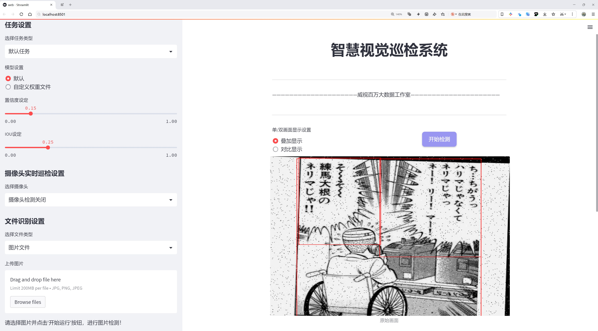
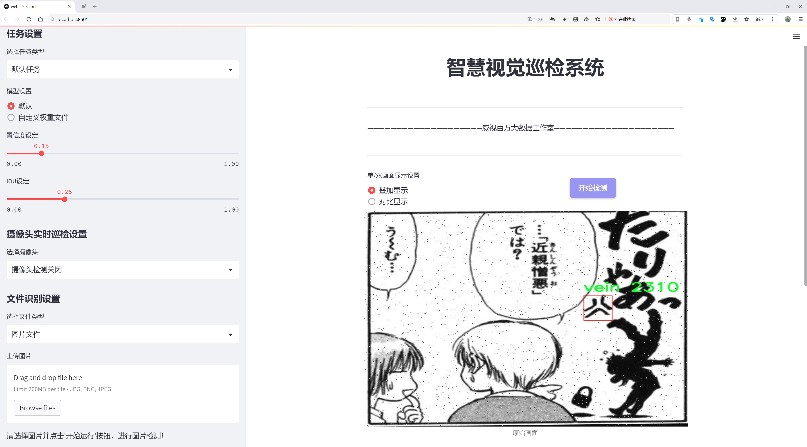

# 鸡蛋检测检测系统源码分享
 # [一条龙教学YOLOV8标注好的数据集一键训练_70+全套改进创新点发刊_Web前端展示]

### 1.研究背景与意义

项目参考[AAAI Association for the Advancement of Artificial Intelligence](https://gitee.com/qunshansj/projects)

项目来源[AACV Association for the Advancement of Computer Vision](https://gitee.com/qunmasj/projects)

研究背景与意义

随着全球人口的持续增长，食品安全和农业生产效率的问题日益凸显。鸡蛋作为一种重要的蛋白质来源，广泛应用于人类饮食中，其生产和质量控制显得尤为重要。传统的鸡蛋检测方法主要依赖人工检验，存在效率低、误差大、劳动强度高等问题，难以满足现代化生产的需求。因此，基于计算机视觉的自动化检测系统逐渐成为研究的热点，能够有效提高鸡蛋的检测效率和准确性。

在众多计算机视觉技术中，YOLO（You Only Look Once）系列模型因其实时性和高准确率而备受关注。YOLOv8作为该系列的最新版本，具备了更强的特征提取能力和更快的推理速度，适合于实时物体检测任务。然而，YOLOv8在特定应用场景下仍存在一定的局限性，如对小物体的检测能力不足、对不同光照和背景条件的适应性差等。因此，针对鸡蛋检测这一特定任务，对YOLOv8进行改进和优化显得尤为重要。

本研究将基于改进的YOLOv8模型，构建一个高效的鸡蛋检测系统。所使用的数据集“egg_v2”包含2200张鸡蛋图像，尽管类别数量仅为1（鸡蛋），但在实际应用中，鸡蛋的外观、形状、颜色等可能因品种、养殖环境等因素而存在差异。因此，如何利用这些图像数据，提升模型的泛化能力和检测精度，是本研究的核心问题之一。

通过对YOLOv8模型的改进，我们将探索多种数据增强技术，以提高模型对不同环境和条件下鸡蛋的检测能力。此外，针对模型在小物体检测中的不足，我们将引入特征金字塔网络（FPN）等技术，增强模型对小尺寸鸡蛋的识别能力。同时，我们还将优化模型的训练策略，采用迁移学习的方法，以加速模型的收敛速度，提高检测精度。

本研究的意义不仅在于提升鸡蛋检测的自动化水平，更在于为农业生产提供一种高效、可靠的质量控制手段。通过实现自动化检测，能够减少人工成本，提高生产效率，同时降低因人为因素导致的检测误差。此外，研究成果还可为其他农产品的检测提供借鉴，推动农业智能化的发展。

综上所述，基于改进YOLOv8的鸡蛋检测系统的研究，不仅具有重要的理论价值，也具备广泛的应用前景。通过深入探讨计算机视觉技术在农业领域的应用，能够为实现农业现代化、提升食品安全水平做出积极贡献。

### 2.图片演示






##### 注意：由于此博客编辑较早，上面“2.图片演示”和“3.视频演示”展示的系统图片或者视频可能为老版本，新版本在老版本的基础上升级如下：（实际效果以升级的新版本为准）

  （1）适配了YOLOV8的“目标检测”模型和“实例分割”模型，通过加载相应的权重（.pt）文件即可自适应加载模型。

  （2）支持“图片识别”、“视频识别”、“摄像头实时识别”三种识别模式。

  （3）支持“图片识别”、“视频识别”、“摄像头实时识别”三种识别结果保存导出，解决手动导出（容易卡顿出现爆内存）存在的问题，识别完自动保存结果并导出到tempDir中。

  （4）支持Web前端系统中的标题、背景图等自定义修改，后面提供修改教程。

  另外本项目提供训练的数据集和训练教程,暂不提供权重文件（best.pt）,需要您按照教程进行训练后实现图片演示和Web前端界面演示的效果。

### 3.视频演示

[3.1 视频演示](https://www.bilibili.com/video/BV1iF4DeFEo5/)

### 4.数据集信息展示

##### 4.1 本项目数据集详细数据（类别数＆类别名）

nc: 1
names: ['egg']


##### 4.2 本项目数据集信息介绍

数据集信息展示

在本研究中，我们采用了名为“egg_v2”的数据集，以支持对YOLOv8模型的改进，旨在提升鸡蛋检测系统的性能和准确性。该数据集专门针对鸡蛋的检测任务进行了精心设计，包含了丰富的图像数据和标注信息，确保模型在实际应用中能够有效识别和定位鸡蛋。数据集的类别数量为1，类别列表中仅包含“egg”这一项，突显了我们研究的专一性和针对性。

“egg_v2”数据集的构建过程经过了严格的筛选和标注，以确保数据的质量和多样性。数据集中包含的图像涵盖了不同的环境、光照条件和背景，使得模型在训练过程中能够学习到更为广泛的特征。这种多样性不仅提高了模型的鲁棒性，也使得其在实际应用中能够适应不同的场景。例如，数据集中可能包含在农场、超市、家庭厨房等不同环境下拍摄的鸡蛋图像，这些图像可能具有不同的颜色、形状和大小，从而为模型提供了丰富的学习素材。

此外，数据集中的图像标注采用了高精度的边界框技术，确保每个鸡蛋在图像中的位置和大小被准确记录。这种精确的标注对于训练YOLOv8模型至关重要，因为它直接影响到模型的检测精度和召回率。通过对每个鸡蛋进行细致的标注，模型能够更好地学习到鸡蛋的特征，进而提高其在复杂场景下的检测能力。

在数据集的使用过程中，我们还进行了数据增强处理，以进一步提升模型的泛化能力。通过旋转、缩放、裁剪和颜色变换等技术，我们为“egg_v2”数据集生成了大量的变体图像。这些增强后的图像不仅增加了训练样本的数量，还帮助模型更好地适应不同的视觉变化，从而在实际应用中实现更高的检测准确率。

值得一提的是，“egg_v2”数据集的设计和构建充分考虑了实际应用的需求，旨在为农业生产、食品安全检测等领域提供有效的技术支持。通过对鸡蛋的自动检测，能够显著提高生产效率，降低人工成本，同时确保产品质量。随着YOLOv8模型的不断改进和优化，我们相信“egg_v2”数据集将为鸡蛋检测技术的发展提供坚实的基础。

总之，“egg_v2”数据集不仅为YOLOv8模型的训练提供了必要的数据支持，也为未来的研究和应用奠定了良好的基础。通过对该数据集的深入分析和利用，我们期望能够推动鸡蛋检测技术的进步，助力相关行业的智能化发展。


### 5.全套项目环境部署视频教程（零基础手把手教学）

[5.1 环境部署教程链接（零基础手把手教学）](https://www.ixigua.com/7404473917358506534?logTag=c807d0cbc21c0ef59de5)


[5.2 安装Python虚拟环境创建和依赖库安装视频教程链接（零基础手把手教学）](https://www.ixigua.com/7404474678003106304?logTag=1f1041108cd1f708b01a)

### 6.手把手YOLOV8训练视频教程（零基础小白有手就能学会）

[6.1 手把手YOLOV8训练视频教程（零基础小白有手就能学会）](https://www.ixigua.com/7404477157818401292?logTag=d31a2dfd1983c9668658)

### 7.70+种全套YOLOV8创新点代码加载调参视频教程（一键加载写好的改进模型的配置文件）

[7.1 70+种全套YOLOV8创新点代码加载调参视频教程（一键加载写好的改进模型的配置文件）](https://www.ixigua.com/7404478314661806627?logTag=29066f8288e3f4eea3a4)

### 8.70+种全套YOLOV8创新点原理讲解（非科班也可以轻松写刊发刊，V10版本正在科研待更新）

由于篇幅限制，每个创新点的具体原理讲解就不一一展开，具体见下列网址中的创新点对应子项目的技术原理博客网址【Blog】：


[8.1 70+种全套YOLOV8创新点原理讲解链接](https://gitee.com/qunmasj/good)

### 9.系统功能展示（检测对象为举例，实际内容以本项目数据集为准）

图9.1.系统支持检测结果表格显示

  图9.2.系统支持置信度和IOU阈值手动调节

  图9.3.系统支持自定义加载权重文件best.pt(需要你通过步骤5中训练获得)

  图9.4.系统支持摄像头实时识别

  图9.5.系统支持图片识别

  图9.6.系统支持视频识别

  图9.7.系统支持识别结果文件自动保存

  图9.8.系统支持Excel导出检测结果数据


### 10.原始YOLOV8算法原理

原始YOLOv8算法原理

YOLOv8作为YOLO系列算法的最新版本，于2023年1月正式推出，标志着计算机视觉领域目标检测技术的又一次重大进步。该算法在检测精度和执行速度上均优于前代模型，成为当前最先进的对象检测与实例分割模型之一。YOLOv8的设计灵感源自于前几代YOLO模型，如YOLOv5、YOLOv6和YOLOX，吸收了它们的优点，并在此基础上进行了全面的改进与创新。通过对模型结构的优化，YOLOv8不仅保持了YOLOv5在工程化上的简洁易用性，还在功能上进行了扩展，支持小目标检测和高分辨率图像处理，进一步提升了模型的应用范围。

YOLOv8的网络结构主要由四个部分组成：输入层、Backbone骨干网络、Neck特征融合网络和Head检测模块。输入层负责对输入图像进行预处理，包括调整图像比例、实现Mosaic增强和瞄点计算等，以便为后续的特征提取和检测做好准备。Backbone部分采用了新的C2f模块替代了传统的C3模块，这一改变使得网络在特征提取时能够实现更丰富的梯度流动，增强了模型对细节信息的捕捉能力。通过增加跳层连接和Split操作，YOLOv8能够更有效地融合不同层次的特征，提升了特征提取的效率和准确性。

在特征融合方面，YOLOv8依然采用了“双塔结构”，结合了特征金字塔网络（FPN）和路径聚合网络（PAN），这使得语义特征和定位特征能够更好地进行转移与融合。通过这种结构，YOLOv8能够获取更丰富的特征信息，从而在不同尺度的目标检测中表现出色。特征融合的过程不仅提高了模型对小目标的检测能力，也增强了其在复杂场景下的适应性。

YOLOv8的Head检测模块是其最大的创新之一。与YOLOv5的耦合头结构不同，YOLOv8采用了解耦头结构，将回归分支和分类分支进行了分离。这一设计不仅简化了模型的结构，还加速了模型的收敛速度，使得训练过程更加高效。此外，YOLOv8引入了Anchor-Free的检测方式，摒弃了传统的Anchor-Based方法，进一步提升了模型的灵活性和准确性。通过这一系列的改进，YOLOv8在COCOVal2017数据集上的表现显著优于其前身，尤其是在识别准确性和训练速度方面。

值得一提的是，YOLOv8的损失函数也经过了重新设计，以适应新的模型结构和任务需求。这一损失函数不仅考虑了分类和回归的准确性，还综合了模型在不同条件下的表现，确保了模型在实际应用中的稳定性和可靠性。通过这些创新，YOLOv8在各种硬件平台上均能高效运行，从CPU到GPU的广泛兼容性使得其在实际应用中具备了极大的灵活性。

在具体应用方面，YOLOv8被广泛用于垃圾检测、行人识别、车辆检测等多个领域，展现了其强大的实用性和适应性。通过对模型的不断优化和改进，YOLOv8不仅提升了目标检测的精度和速度，还为后续的研究和应用提供了坚实的基础。随着YOLOv8的推广和应用，计算机视觉领域的目标检测技术将迎来新的发展机遇，推动智能化技术的进一步普及。

总之，YOLOv8作为YOLO系列的最新版本，凭借其创新的网络结构、灵活的检测方式和高效的训练过程，成功地在目标检测领域树立了新的标杆。它的推出不仅为研究人员提供了一个强大的工具，也为实际应用带来了更多的可能性。随着技术的不断进步，YOLOv8无疑将在未来的计算机视觉应用中发挥越来越重要的作用。


### 11.项目核心源码讲解（再也不用担心看不懂代码逻辑）

#### 11.1 ui.py

以下是代码的核心部分，并附上详细的中文注释：

```python
import sys
import subprocess

def run_script(script_path):
    """
    使用当前 Python 环境运行指定的脚本。

    Args:
        script_path (str): 要运行的脚本路径

    Returns:
        None
    """
    # 获取当前 Python 解释器的路径
    python_path = sys.executable

    # 构建运行命令，使用 streamlit 运行指定的脚本
    command = f'"{python_path}" -m streamlit run "{script_path}"'

    # 执行命令，并等待其完成
    result = subprocess.run(command, shell=True)
    
    # 检查命令执行结果，如果返回码不为0，则表示出错
    if result.returncode != 0:
        print("脚本运行出错。")

# 主程序入口
if __name__ == "__main__":
    # 指定要运行的脚本路径
    script_path = "web.py"  # 这里可以直接指定脚本名，假设它在当前目录下

    # 调用函数运行脚本
    run_script(script_path)
```

### 代码分析：
1. **导入模块**：
   - `sys`：用于获取当前 Python 解释器的路径。
   - `subprocess`：用于执行外部命令。

2. **`run_script` 函数**：
   - 功能：接收一个脚本路径，使用当前 Python 环境运行该脚本。
   - `script_path` 参数：指定要运行的脚本的路径。
   - 使用 `sys.executable` 获取当前 Python 解释器的路径，以确保脚本在正确的环境中运行。
   - 构建命令字符串，使用 `streamlit` 运行指定的脚本。
   - 使用 `subprocess.run` 执行命令，并等待其完成。
   - 检查命令的返回码，如果不为0，表示脚本运行出错，打印错误信息。

3. **主程序入口**：
   - 使用 `if __name__ == "__main__":` 确保只有在直接运行该脚本时才会执行后续代码。
   - 指定要运行的脚本路径（这里假设为 `web.py`）。
   - 调用 `run_script` 函数来执行指定的脚本。

这个文件名为 `ui.py`，它的主要功能是通过当前的 Python 环境来运行一个指定的脚本。文件中首先导入了几个必要的模块，包括 `sys`、`os` 和 `subprocess`，以及一个自定义的模块 `QtFusion.path` 中的 `abs_path` 函数。

在 `run_script` 函数中，首先获取当前 Python 解释器的路径，这样可以确保在正确的环境中运行脚本。接着，构建一个命令字符串，该命令用于调用 `streamlit` 运行指定的脚本。这里使用了 `-m` 参数来运行 `streamlit` 模块，并传入脚本的路径。

然后，使用 `subprocess.run` 方法执行这个命令。这个方法会在一个新的子进程中运行命令，并等待其完成。如果脚本运行返回的状态码不为零，表示运行过程中出现了错误，此时会打印出“脚本运行出错”的提示信息。

在文件的最后部分，使用 `if __name__ == "__main__":` 语句来确保当该文件作为主程序运行时，才会执行以下代码。这里指定了要运行的脚本路径为 `web.py`，并调用 `run_script` 函数来执行这个脚本。

总体来说，这个程序的功能是提供一个简单的接口，通过当前的 Python 环境来运行一个名为 `web.py` 的脚本，并处理可能出现的错误。

#### 11.2 70+种YOLOv8算法改进源码大全和调试加载训练教程（非必要）\ultralytics\models\yolo\pose\val.py

以下是经过简化和注释的核心代码部分：

```python
# 导入必要的库
from ultralytics.models.yolo.detect import DetectionValidator
from ultralytics.utils import ops
from ultralytics.utils.metrics import PoseMetrics, box_iou, kpt_iou

class PoseValidator(DetectionValidator):
    """
    PoseValidator类，继承自DetectionValidator，用于基于姿态模型的验证。
    """

    def __init__(self, dataloader=None, save_dir=None, args=None):
        """初始化PoseValidator对象，设置参数和属性。"""
        super().__init__(dataloader, save_dir, args=args)
        self.kpt_shape = None  # 关键点形状
        self.metrics = PoseMetrics(save_dir=self.save_dir)  # 初始化姿态度量

    def preprocess(self, batch):
        """预处理批次数据，将关键点数据转换为浮点数并移动到设备上。"""
        batch = super().preprocess(batch)  # 调用父类的预处理方法
        batch['keypoints'] = batch['keypoints'].to(self.device).float()  # 转换关键点数据类型
        return batch

    def postprocess(self, preds):
        """应用非最大抑制，返回高置信度的检测结果。"""
        return ops.non_max_suppression(preds, self.args.conf, self.args.iou)

    def update_metrics(self, preds, batch):
        """更新度量，计算预测与真实标签之间的匹配情况。"""
        for si, pred in enumerate(preds):
            idx = batch['batch_idx'] == si  # 获取当前批次的索引
            cls = batch['cls'][idx]  # 获取当前批次的类别
            bbox = batch['bboxes'][idx]  # 获取当前批次的边界框
            kpts = batch['keypoints'][idx]  # 获取当前批次的关键点
            npr = pred.shape[0]  # 预测数量

            if npr == 0:  # 如果没有预测结果
                continue

            # 处理预测框和关键点
            predn = pred.clone()  # 克隆预测结果
            ops.scale_boxes(batch['img'][si].shape[1:], predn[:, :4], batch['ori_shape'][si])  # 缩放边界框
            pred_kpts = predn[:, 6:].view(npr, -1, 3)  # 处理关键点

            # 计算IoU
            if cls.shape[0] > 0:  # 如果有真实标签
                correct_bboxes = self._process_batch(predn[:, :6], batch['cls'][idx], bbox)  # 处理边界框
                correct_kpts = self._process_batch(predn[:, :6], batch['cls'][idx], pred_kpts, kpts)  # 处理关键点

            # 更新统计信息
            self.stats.append((correct_bboxes, correct_kpts))

    def _process_batch(self, detections, labels, pred_kpts=None, gt_kpts=None):
        """
        处理批次数据，返回正确的预测矩阵。
        """
        if pred_kpts is not None and gt_kpts is not None:
            iou = kpt_iou(gt_kpts, pred_kpts)  # 计算关键点IoU
        else:
            iou = box_iou(labels[:, 1:], detections[:, :4])  # 计算边界框IoU

        return self.match_predictions(detections[:, 5], labels[:, 0], iou)  # 匹配预测结果

```

### 代码注释说明：
1. **导入库**：导入了必要的模块和类，包括检测验证器和相关的操作与度量工具。
2. **PoseValidator类**：这是一个用于姿态验证的类，继承自DetectionValidator，主要用于处理姿态检测的相关逻辑。
3. **初始化方法**：在初始化时，设置了必要的属性，并调用父类的初始化方法。
4. **预处理方法**：对输入的批次数据进行预处理，主要是将关键点数据转换为浮点数并移动到指定设备。
5. **后处理方法**：应用非最大抑制来过滤低置信度的检测结果。
6. **更新度量方法**：计算预测结果与真实标签之间的匹配情况，并更新统计信息。
7. **处理批次方法**：根据检测结果和标签计算IoU（交并比），并返回正确的预测矩阵。

这些核心部分和注释帮助理解PoseValidator类的功能和工作流程。

该程序文件是一个用于YOLOv8模型的姿态估计验证器的实现，继承自`DetectionValidator`类。其主要功能是对姿态检测模型的输出进行验证和评估，具体包括数据预处理、后处理、指标计算和结果可视化等。

首先，文件导入了一些必要的库和模块，包括路径处理、NumPy、PyTorch等。接着定义了`PoseValidator`类，该类在初始化时调用父类的构造函数，并设置了一些特定于姿态估计的参数，如`self.sigma`和`self.kpt_shape`。在初始化过程中，还检查了设备类型，如果使用的是Apple的MPS设备，程序会发出警告，建议使用CPU。

在`preprocess`方法中，输入的批次数据会被转换为浮点数并移动到指定的设备上，主要是处理关键点数据。`get_desc`方法返回评估指标的描述字符串，用于在输出中显示。

`postprocess`方法应用非极大值抑制，过滤掉低置信度的检测结果，返回高置信度的检测框。`init_metrics`方法用于初始化姿态估计的指标，判断关键点的形状是否符合预期，并设置相应的标准差。

在`update_metrics`方法中，程序会遍历每个预测结果，计算与真实标签的匹配情况，包括关键点和边界框的正确性。通过调用`_process_batch`方法，计算出正确的预测矩阵，并更新统计信息。

`plot_val_samples`和`plot_predictions`方法用于可视化验证集样本和模型预测结果，生成带有边界框和关键点的图像，并保存到指定目录。

`pred_to_json`方法将YOLO的预测结果转换为COCO格式的JSON文件，方便后续的评估。`eval_json`方法则利用COCO API对模型的检测结果进行评估，计算mAP等指标，并输出评估结果。

整体来看，该文件实现了YOLOv8姿态估计模型的验证流程，涵盖了从数据预处理到结果评估的各个环节，具有较强的实用性和可扩展性。

#### 11.3 code\ultralytics\models\nas\val.py

以下是代码中最核心的部分，并附上详细的中文注释：

```python
import torch
from ultralytics.utils import ops

class NASValidator:
    """
    Ultralytics YOLO NAS 验证器，用于目标检测。

    该类用于对 YOLO NAS 模型生成的原始预测结果进行后处理。它执行非极大值抑制（NMS），以去除重叠和低置信度的框，最终生成最终检测结果。
    """

    def postprocess(self, preds_in):
        """对预测输出应用非极大值抑制（NMS）。"""
        # 将预测框的坐标从 xyxy 格式转换为 xywh 格式
        boxes = ops.xyxy2xywh(preds_in[0][0])
        
        # 将框和置信度合并，并调整维度顺序
        preds = torch.cat((boxes, preds_in[0][1]), -1).permute(0, 2, 1)
        
        # 应用非极大值抑制，去除重叠的框
        return ops.non_max_suppression(
            preds,                      # 输入的预测结果
            self.args.conf,            # 置信度阈值
            self.args.iou,             # IoU 阈值
            labels=self.lb,            # 多标签 NMS 的标签（可选）
            multi_label=False,         # 是否使用多标签
            agnostic=self.args.single_cls,  # 是否对类别不敏感
            max_det=self.args.max_det, # 最大检测框数量
            max_time_img=0.5,         # 每张图片的最大处理时间
        )
```

### 代码注释说明：

1. **导入模块**：
   - `torch`：用于深度学习的核心库。
   - `ops`：包含各种操作的工具库，这里主要用于坐标转换和非极大值抑制。

2. **NASValidator 类**：
   - 该类用于处理 YOLO NAS 模型的预测结果，主要功能是后处理预测框，去除重叠和低置信度的框。

3. **postprocess 方法**：
   - 该方法接收原始预测结果 `preds_in`，并对其进行后处理。
   - `ops.xyxy2xywh`：将预测框的坐标从 (x1, y1, x2, y2) 格式转换为 (x_center, y_center, width, height) 格式。
   - `torch.cat`：将框和置信度合并成一个张量，并调整维度顺序以适应后续处理。
   - `ops.non_max_suppression`：执行非极大值抑制，去除重叠的框，返回最终的检测结果。

这个程序文件是一个用于对象检测的验证器，名为 `NASValidator`，它是基于 Ultralytics YOLO 模型的一个扩展类。该类主要用于处理 YOLO NAS 模型生成的原始预测结果，特别是进行后处理，以便从中提取最终的检测结果。

首先，文件导入了必要的库，包括 `torch` 和 `DetectionValidator` 类。`DetectionValidator` 是 Ultralytics 模型包中的一个类，`NASValidator` 继承自它。该类的主要功能是对 YOLO NAS 模型的预测结果进行非极大值抑制（NMS），以去除重叠和低置信度的边界框，从而生成最终的检测结果。

在类的文档字符串中，描述了该类的用途和一些重要的属性。`args` 属性是一个命名空间，包含了各种后处理的配置参数，例如置信度和 IoU（交并比）阈值。`lb` 属性是一个可选的张量，用于多标签 NMS。

示例代码展示了如何使用 `NASValidator`。首先，导入 `NAS` 类并实例化一个 YOLO NAS 模型。然后，通过模型的 `validator` 属性获取验证器，并假设已经有了原始预测结果 `raw_preds`，可以调用 `postprocess` 方法来获取最终的预测结果。

`postprocess` 方法是该类的核心功能之一，它接收原始预测结果 `preds_in`，并应用非极大值抑制。具体步骤包括将预测框的坐标从 xyxy 格式转换为 xywh 格式，然后将框和置信度合并，并进行 NMS 处理。该方法的参数包括置信度阈值、IoU 阈值、标签等，以便在处理时能够灵活控制检测的结果。

总的来说，`NASValidator` 类为 YOLO NAS 模型提供了一个有效的后处理工具，使得从原始预测中提取出高质量的检测结果成为可能。

#### 11.4 code\ultralytics\utils\loss.py

以下是经过简化和注释的核心代码部分，主要集中在损失计算的类上，特别是与目标检测相关的损失函数。

```python
import torch
import torch.nn as nn
import torch.nn.functional as F

class BboxLoss(nn.Module):
    """计算边界框损失的类。"""

    def __init__(self, reg_max, use_dfl=False):
        """初始化 BboxLoss 模块，设置最大正则化和 DFL 设置。"""
        super().__init__()
        self.reg_max = reg_max  # 最大正则化值
        self.use_dfl = use_dfl  # 是否使用分布焦点损失

    def forward(self, pred_dist, pred_bboxes, anchor_points, target_bboxes, target_scores, target_scores_sum, fg_mask):
        """计算 IoU 损失和 DFL 损失。"""
        weight = target_scores.sum(-1)[fg_mask].unsqueeze(-1)  # 计算权重
        iou = bbox_iou(pred_bboxes[fg_mask], target_bboxes[fg_mask], xywh=False, CIoU=True)  # 计算 IoU
        loss_iou = ((1.0 - iou) * weight).sum() / target_scores_sum  # IoU 损失

        # 如果使用 DFL，计算 DFL 损失
        if self.use_dfl:
            target_ltrb = bbox2dist(anchor_points, target_bboxes, self.reg_max)  # 将目标框转换为距离
            loss_dfl = self._df_loss(pred_dist[fg_mask].view(-1, self.reg_max + 1), target_ltrb[fg_mask]) * weight  # 计算 DFL 损失
            loss_dfl = loss_dfl.sum() / target_scores_sum  # DFL 损失归一化
        else:
            loss_dfl = torch.tensor(0.0).to(pred_dist.device)  # 如果不使用 DFL，损失为 0

        return loss_iou, loss_dfl  # 返回 IoU 损失和 DFL 损失

    @staticmethod
    def _df_loss(pred_dist, target):
        """计算分布焦点损失（DFL）。"""
        tl = target.long()  # 目标左边界
        tr = tl + 1  # 目标右边界
        wl = tr - target  # 左边权重
        wr = 1 - wl  # 右边权重
        return (
            F.cross_entropy(pred_dist, tl.view(-1), reduction="none").view(tl.shape) * wl  # 左边 DFL
            + F.cross_entropy(pred_dist, tr.view(-1), reduction="none").view(tl.shape) * wr  # 右边 DFL
        ).mean(-1, keepdim=True)  # 返回平均损失

class v8DetectionLoss:
    """计算目标检测损失的类。"""

    def __init__(self, model):
        """初始化 v8DetectionLoss，设置模型相关属性和 BCE 损失函数。"""
        device = next(model.parameters()).device  # 获取模型设备
        m = model.model[-1]  # 获取检测模块
        self.bce = nn.BCEWithLogitsLoss(reduction="none")  # 二元交叉熵损失
        self.reg_max = m.reg_max  # 最大正则化值
        self.device = device  # 设备
        self.bbox_loss = BboxLoss(m.reg_max - 1, use_dfl=m.reg_max > 1).to(device)  # 初始化边界框损失

    def __call__(self, preds, batch):
        """计算损失并返回。"""
        loss = torch.zeros(3, device=self.device)  # 初始化损失数组
        pred_distri, pred_scores = preds  # 获取预测分布和分数

        # 计算目标
        targets = torch.cat((batch["batch_idx"].view(-1, 1), batch["cls"].view(-1, 1), batch["bboxes"]), 1)
        gt_labels, gt_bboxes = targets.split((1, 4), 2)  # 分离标签和边界框

        # 计算边界框损失
        pred_bboxes = self.bbox_decode(pred_distri)  # 解码预测边界框
        _, target_bboxes, target_scores, fg_mask, _ = self.assigner(
            pred_scores.detach().sigmoid(),
            pred_bboxes,
            gt_labels,
            gt_bboxes,
        )

        target_scores_sum = max(target_scores.sum(), 1)  # 计算目标分数总和

        # 计算分类损失
        loss[1] = self.bce(pred_scores, target_scores.to(pred_scores.dtype)).sum() / target_scores_sum  # 分类损失

        # 计算边界框损失
        if fg_mask.sum():
            loss[0], loss[2] = self.bbox_loss(
                pred_distri, pred_bboxes, target_bboxes, target_scores, target_scores_sum, fg_mask
            )

        return loss.sum() * batch_size, loss.detach()  # 返回总损失和分离的损失
```

### 代码注释说明：
1. **BboxLoss 类**：计算边界框的损失，包括 IoU 损失和可选的分布焦点损失（DFL）。
   - `forward` 方法计算 IoU 损失和 DFL 损失。
   - `_df_loss` 方法计算 DFL 损失。

2. **v8DetectionLoss 类**：用于计算目标检测的总损失。
   - `__call__` 方法负责处理输入，计算分类损失和边界框损失，并返回总损失。

通过这种方式，代码的核心部分得以保留，同时也添加了详细的中文注释，帮助理解每个部分的功能。

这个文件 `loss.py` 是一个用于计算各种损失函数的模块，主要用于训练 YOLO（You Only Look Once）目标检测模型。文件中定义了多个损失类，每个类负责计算特定类型的损失，以便在训练过程中优化模型的性能。

首先，文件导入了必要的 PyTorch 库和一些工具函数，这些工具函数用于处理目标检测中的各种计算，如框的 IOU（Intersection over Union）计算、坐标转换等。

`VarifocalLoss` 类实现了一种变焦损失函数，主要用于处理目标检测中的类别不平衡问题。它通过调整损失的权重来强化对难以分类样本的关注。该类的 `forward` 方法计算损失时，使用了 Sigmoid 函数和二元交叉熵损失。

`FocalLoss` 类是另一种损失函数，旨在减少易分类样本的影响，增强难分类样本的权重。它通过计算预测概率和目标标签之间的损失，并应用调制因子来实现这一点。

`BboxLoss` 类专注于计算边界框的损失，结合了 IOU 和分布焦点损失（DFL）。它在计算损失时，首先计算预测框与目标框之间的 IOU，然后根据目标的得分和前景掩码来加权损失。

`RotatedBboxLoss` 类是 `BboxLoss` 的扩展，专门用于处理旋转边界框的损失计算。它的实现与 `BboxLoss` 类似，但使用了旋转框的特定计算方法。

`KeypointLoss` 类用于计算关键点的损失，主要用于姿态估计任务。它计算预测关键点与真实关键点之间的欧几里得距离，并根据目标区域的大小进行归一化。

`v8DetectionLoss` 类是一个综合性的损失计算类，整合了边界框损失、分类损失和 DFL。它在初始化时设置了一些超参数，并定义了预处理和解码方法，以便在训练过程中使用。

`v8SegmentationLoss` 类扩展了 `v8DetectionLoss`，增加了对分割任务的支持。它在计算损失时，除了边界框和分类损失外，还计算了分割掩码的损失。

`v8PoseLoss` 类同样扩展了 `v8DetectionLoss`，专注于姿态估计任务，计算关键点的损失。

`v8ClassificationLoss` 类则是一个简单的分类损失计算类，使用交叉熵损失来评估分类性能。

最后，`v8OBBLoss` 类是针对旋转边界框的损失计算类，专门处理旋转框的损失和相关的计算。

整体而言，这个文件通过定义不同的损失类，为 YOLO 模型的训练提供了灵活的损失计算方法，能够适应不同的任务需求，如目标检测、实例分割和姿态估计等。每个损失类都实现了 `forward` 方法，计算相应的损失，并在训练过程中通过反向传播优化模型参数。

#### 11.5 code\ultralytics\cfg\__init__.py

以下是代码中最核心的部分，并附上详细的中文注释：

```python
def cfg2dict(cfg):
    """
    将配置对象转换为字典格式，可以是文件路径、字符串或SimpleNamespace对象。

    参数:
        cfg (str | Path | dict | SimpleNamespace): 要转换为字典的配置对象。

    返回:
        cfg (dict): 转换后的字典格式配置对象。
    """
    if isinstance(cfg, (str, Path)):
        cfg = yaml_load(cfg)  # 从文件加载字典
    elif isinstance(cfg, SimpleNamespace):
        cfg = vars(cfg)  # 将SimpleNamespace转换为字典
    return cfg


def get_cfg(cfg: Union[str, Path, Dict, SimpleNamespace] = DEFAULT_CFG_DICT, overrides: Dict = None):
    """
    从文件或字典加载并合并配置数据。

    参数:
        cfg (str | Path | Dict | SimpleNamespace): 配置数据。
        overrides (str | Dict | optional): 覆盖的配置，可以是文件名或字典。默认为None。

    返回:
        (SimpleNamespace): 训练参数的命名空间。
    """
    cfg = cfg2dict(cfg)

    # 合并覆盖配置
    if overrides:
        overrides = cfg2dict(overrides)
        if "save_dir" not in cfg:
            overrides.pop("save_dir", None)  # 忽略特殊的覆盖键
        check_dict_alignment(cfg, overrides)
        cfg = {**cfg, **overrides}  # 合并cfg和overrides字典（优先使用overrides）

    # 特殊处理数字类型的项目/名称
    for k in "project", "name":
        if k in cfg and isinstance(cfg[k], (int, float)):
            cfg[k] = str(cfg[k])
    if cfg.get("name") == "model":  # 将模型名称分配给'name'参数
        cfg["name"] = cfg.get("model", "").split(".")[0]
        LOGGER.warning(f"WARNING ⚠️ 'name=model' 自动更新为 'name={cfg['name']}'.")

    # 类型和值检查
    for k, v in cfg.items():
        if v is not None:  # None值可能来自可选参数
            if k in CFG_FLOAT_KEYS and not isinstance(v, (int, float)):
                raise TypeError(
                    f"'{k}={v}' 的类型 {type(v).__name__} 无效。 "
                    f"有效的 '{k}' 类型是 int（例如 '{k}=0'）或 float（例如 '{k}=0.5'）"
                )
            elif k in CFG_FRACTION_KEYS:
                if not isinstance(v, (int, float)):
                    raise TypeError(
                        f"'{k}={v}' 的类型 {type(v).__name__} 无效。 "
                        f"有效的 '{k}' 类型是 int（例如 '{k}=0'）或 float（例如 '{k}=0.5'）"
                    )
                if not (0.0 <= v <= 1.0):
                    raise ValueError(f"'{k}={v}' 的值无效。 " f"有效的 '{k}' 值在 0.0 和 1.0 之间。")
            elif k in CFG_INT_KEYS and not isinstance(v, int):
                raise TypeError(
                    f"'{k}={v}' 的类型 {type(v).__name__} 无效。 " f"'{k}' 必须是 int（例如 '{k}=8'）"
                )
            elif k in CFG_BOOL_KEYS and not isinstance(v, bool):
                raise TypeError(
                    f"'{k}={v}' 的类型 {type(v).__name__} 无效。 "
                    f"'{k}' 必须是 bool（例如 '{k}=True' 或 '{k}=False'）"
                )

    # 返回命名空间实例
    return IterableSimpleNamespace(**cfg)


def entrypoint(debug=""):
    """
    这是ultralytics包的入口点，负责解析传递给包的命令行参数。

    该函数允许：
    - 传递必需的YOLO参数作为字符串列表
    - 指定要执行的任务，如'detect'、'segment'或'classify'
    - 指定模式，如'train'、'val'、'test'或'predict'
    - 运行特殊模式，如'checks'
    - 传递覆盖包配置的参数

    它使用包的默认配置并使用传递的覆盖进行初始化。
    然后调用CLI函数，使用组合的配置
    """
    args = (debug.split(" ") if debug else sys.argv)[1:]
    if not args:  # 没有传递参数
        LOGGER.info(CLI_HELP_MSG)
        return

    # 处理特殊命令
    special = {
        "help": lambda: LOGGER.info(CLI_HELP_MSG),
        "checks": checks.collect_system_info,
        "version": lambda: LOGGER.info(__version__),
        "settings": lambda: handle_yolo_settings(args[1:]),
        "cfg": lambda: yaml_print(DEFAULT_CFG_PATH),
        "hub": lambda: handle_yolo_hub(args[1:]),
        "login": lambda: handle_yolo_hub(args),
        "copy-cfg": copy_default_cfg,
        "explorer": lambda: handle_explorer(),
    }
    
    # 其他参数处理
    # ...（省略其他处理逻辑）

    # 运行命令
    getattr(model, mode)(**overrides)  # 使用模型的默认参数运行命令

    # 显示帮助信息
    LOGGER.info(f"💡 了解更多信息请访问 https://docs.ultralytics.com/modes/{mode}")


if __name__ == "__main__":
    # 示例: entrypoint(debug='yolo predict model=yolov8n.pt')
    entrypoint(debug="")
```

### 主要功能说明：
1. **cfg2dict**: 将配置对象转换为字典格式，支持多种输入类型。
2. **get_cfg**: 加载并合并配置数据，进行类型和值的检查，返回一个命名空间对象。
3. **entrypoint**: 作为程序的入口，解析命令行参数，处理不同的任务和模式，并执行相应的功能。

这个程序文件是Ultralytics YOLO的配置模块，主要用于处理与YOLO模型相关的各种配置和命令行参数。文件中导入了多个模块和工具，包括路径处理、类型检查和日志记录等功能。接下来，我们逐步分析文件中的主要内容。

首先，定义了一些有效的任务和模式。任务包括目标检测、分割、分类、姿态估计和有边界框的检测等，而模式则包括训练、验证、预测、导出、跟踪和基准测试。这些任务和模式的映射关系被存储在字典中，以便后续使用。

接着，文件中定义了一些用于命令行界面的帮助信息，提供了关于如何使用YOLO命令的详细说明，包括示例命令和参数的用法。这些信息对于用户理解如何操作YOLO模型非常重要。

文件中还定义了一些配置键的类型，包括浮点数、整数、布尔值等，以便在后续的配置检查中使用。通过这些定义，程序能够确保用户输入的参数类型是正确的。

`cfg2dict`函数用于将配置对象转换为字典格式，支持多种输入类型，包括字符串、路径、字典和SimpleNamespace对象。这个函数在加载配置时非常有用。

`get_cfg`函数负责加载和合并配置数据。它首先将输入的配置转换为字典格式，然后合并用户的覆盖配置，并进行类型和值的检查，确保所有参数都符合预期的格式和范围。最终，它返回一个包含所有配置的SimpleNamespace对象，方便后续使用。

`get_save_dir`函数用于生成保存目录的路径，基于用户的输入参数。如果用户没有指定保存目录，程序会根据任务和模式生成一个默认的保存路径。

`_handle_deprecation`函数处理过时的配置键，将其映射到新的键名，并发出警告，提醒用户使用新的配置方式。

`check_dict_alignment`函数用于检查自定义配置与基础配置之间的键是否匹配，如果发现不匹配的键，会提示用户并给出相似的有效键名，帮助用户纠正错误。

`merge_equals_args`函数用于合并参数列表中的等号参数，确保参数格式的正确性。

`handle_yolo_hub`和`handle_yolo_settings`函数分别处理与Ultralytics HUB和YOLO设置相关的命令行操作。这些函数提供了登录、登出、重置设置等功能。

`handle_explorer`函数用于打开Ultralytics Explorer GUI，方便用户进行数据集的可视化和管理。

`parse_key_value_pair`和`smart_value`函数用于解析和转换命令行参数，确保用户输入的值能够被正确识别和处理。

`entrypoint`函数是程序的入口点，负责解析命令行参数并调用相应的功能。它支持多种模式和任务，并根据用户的输入生成相应的模型实例，最后执行指定的操作。

最后，`copy_default_cfg`函数用于复制默认配置文件，以便用户可以在此基础上进行修改。

整个文件的设计旨在提供一个灵活且易于使用的命令行接口，帮助用户方便地配置和使用YOLO模型，进行各种计算机视觉任务。

#### 11.6 70+种YOLOv8算法改进源码大全和调试加载训练教程（非必要）\ultralytics\engine\model.py

以下是代码中最核心的部分，并附上详细的中文注释：

```python
class Model(nn.Module):
    """
    统一所有模型API的基础类。

    参数:
        model (str, Path): 要加载或创建的模型文件路径。
        task (Any, optional): YOLO模型的任务类型。默认为None。

    属性:
        predictor (Any): 预测器对象。
        model (Any): 模型对象。
        trainer (Any): 训练器对象。
        task (str): 模型任务类型。
        ckpt (Any): 如果模型是从*.pt文件加载的，则为检查点对象。
        cfg (str): 如果从*.yaml文件加载，则为模型配置。
        ckpt_path (str): 检查点文件路径。
        overrides (dict): 训练器对象的覆盖参数。
        metrics (Any): 用于度量的数据。
    """

    def __init__(self, model: Union[str, Path] = 'yolov8n.pt', task=None) -> None:
        """
        初始化YOLO模型。

        参数:
            model (Union[str, Path], optional): 要加载或创建的模型的路径或名称。默认为'yolov8n.pt'。
            task (Any, optional): YOLO模型的任务类型。默认为None。
        """
        super().__init__()
        self.predictor = None  # 预测器对象
        self.model = None  # 模型对象
        self.trainer = None  # 训练器对象
        self.task = task  # 任务类型
        model = str(model).strip()  # 去除模型名称的空格

        # 检查是否为Ultralytics HUB模型
        if self.is_hub_model(model):
            from ultralytics.hub.session import HUBTrainingSession
            self.session = HUBTrainingSession(model)  # 创建HUB训练会话
            model = self.session.model_file  # 获取模型文件

        # 加载或创建新的YOLO模型
        suffix = Path(model).suffix  # 获取模型文件后缀
        if suffix in ('.yaml', '.yml'):
            self._new(model, task)  # 从配置文件创建新模型
        else:
            self._load(model, task)  # 从权重文件加载模型

    def predict(self, source=None, stream=False, predictor=None, **kwargs):
        """
        使用YOLO模型进行预测。

        参数:
            source (str | int | PIL | np.ndarray): 要进行预测的图像来源。
            stream (bool): 是否流式传输预测结果。默认为False。
            predictor (BasePredictor): 自定义预测器。
            **kwargs : 传递给预测器的其他关键字参数。

        返回:
            (List[ultralytics.engine.results.Results]): 预测结果。
        """
        if source is None:
            source = ASSETS  # 如果没有提供source，使用默认资产
        # 设置预测器
        if not self.predictor:
            self.predictor = (predictor or self._smart_load('predictor'))(overrides=kwargs)
            self.predictor.setup_model(model=self.model)  # 设置模型
        return self.predictor(source=source, stream=stream)  # 执行预测并返回结果

    def _load(self, weights: str, task=None):
        """
        从权重文件加载模型并推断任务类型。

        参数:
            weights (str): 要加载的模型检查点。
            task (str | None): 模型任务。
        """
        suffix = Path(weights).suffix
        if suffix == '.pt':
            self.model, self.ckpt = attempt_load_one_weight(weights)  # 加载权重
            self.task = self.model.args['task']  # 获取任务类型
        else:
            weights = checks.check_file(weights)  # 检查文件
            self.model, self.ckpt = weights, None
            self.task = task or guess_model_task(weights)  # 推断任务类型
        self.overrides['model'] = weights  # 设置覆盖参数

    def is_hub_model(self, model):
        """检查提供的模型是否为HUB模型。"""
        return model.startswith(f'{HUB_WEB_ROOT}/models/')  # 检查是否以HUB路径开头

    def _new(self, cfg: str, task=None):
        """
        初始化新模型并推断任务类型。

        参数:
            cfg (str): 模型配置文件。
            task (str | None): 模型任务。
        """
        cfg_dict = yaml_model_load(cfg)  # 加载配置文件
        self.cfg = cfg
        self.task = task or guess_model_task(cfg_dict)  # 推断任务类型
        self.model = self._smart_load('model')(cfg_dict)  # 创建模型

    def _smart_load(self, key):
        """加载模型/训练器/验证器/预测器。"""
        try:
            return self.task_map[self.task][key]  # 根据任务类型获取相应的组件
        except Exception as e:
            raise NotImplementedError(f"模型不支持此任务类型: {self.task}") from e

    @property
    def task_map(self):
        """返回任务到模型、训练器、验证器和预测器类的映射。"""
        raise NotImplementedError('请为您的模型提供任务映射！')
```

### 代码说明：
1. **Model类**：这是一个基础类，用于统一YOLO模型的API。它包含了模型的初始化、预测、加载权重等功能。
2. **__init__方法**：初始化模型时，会检查模型类型（HUB模型或权重文件），并根据配置文件或权重文件加载模型。
3. **predict方法**：用于执行预测，接受图像来源和其他参数，并返回预测结果。
4. **_load方法**：从权重文件加载模型，并推断任务类型。
5. **is_hub_model方法**：检查给定的模型是否为HUB模型。
6. **_new方法**：从配置文件创建新模型并推断任务类型。
7. **_smart_load方法**：根据任务类型加载相应的组件。
8. **task_map属性**：用于映射任务到相应的模型、训练器等，但需要具体实现。

这个程序文件是一个实现YOLOv8模型的基础类，主要用于统一不同模型的API接口。它包含了模型的初始化、加载、预测、训练等功能。文件的主要内容包括类的定义、属性、方法以及相关的文档字符串。

在初始化方法`__init__`中，用户可以传入模型的路径或名称以及任务类型。该方法首先检查模型是否来自Ultralytics HUB或Triton Server，然后根据模型的后缀名来决定是加载已有模型还是创建新模型。如果模型是YAML格式的配置文件，则调用`_new`方法；如果是权重文件（如.pt），则调用`_load`方法。

类中有一个`__call__`方法，使得实例可以像函数一样被调用，实际上是调用了`predict`方法进行对象检测。`predict`方法接受图像源、流式处理标志以及其他参数，执行模型的预测功能。

该类还包含了一些静态方法，例如`is_hub_model`和`is_triton_model`，用于判断模型的来源。`_check_is_pytorch_model`方法确保加载的模型是PyTorch格式的，若不是则抛出错误。

模型的训练、验证和超参数调优功能也被实现。`train`方法负责在给定数据集上训练模型，`val`方法用于验证模型的性能，`tune`方法则用于进行超参数的调优。

此外，模型还支持导出功能，用户可以通过`export`方法将模型导出为不同格式。`benchmark`方法用于在所有导出格式上进行基准测试。

类中还定义了一些辅助方法，例如`reset_weights`用于重置模型参数，`info`用于打印模型信息，`fuse`用于加速推理过程。

总的来说，这个文件提供了YOLOv8模型的核心功能，包括模型的加载、预测、训练、验证和导出等，方便用户进行目标检测任务的实现和调试。

### 12.系统整体结构（节选）

### 整体功能和构架概括

该程序的整体功能是实现一个基于YOLOv8架构的目标检测系统，涵盖了模型的训练、验证、推理、损失计算和配置管理等多个方面。程序的构架分为多个模块，每个模块负责特定的功能，使得系统具有良好的可扩展性和可维护性。

1. **模型管理**：通过 `model.py` 实现模型的加载、训练、验证和导出功能。
2. **损失计算**：`loss.py` 提供了多种损失函数的实现，以支持不同的任务需求。
3. **验证器**：`val.py` 文件（包括 `pose` 和 `nas` 版本）负责对模型的输出进行验证和评估，计算指标并生成可视化结果。
4. **配置管理**：`__init__.py` 和 `cfg/__init__.py` 处理模型的配置参数，提供命令行接口，确保用户输入的参数有效。
5. **用户界面**：`ui.py` 提供了一个简单的界面，用于运行特定的脚本。
6. **数据处理**：`annotator.py` 处理数据标注和增强，支持训练数据的准备。
7. **网络结构**：`lsknet.py` 定义了特定的网络结构，用于模型的构建。
8. **工具函数**：`utils.py` 和 `gmc.py` 提供了一些通用的工具函数，支持模型的推理和后处理。

### 文件功能整理表

| 文件路径                                                                                       | 功能描述                                                                                       |
|------------------------------------------------------------------------------------------------|-----------------------------------------------------------------------------------------------|
| `ui.py`                                                                                       | 提供一个简单的用户界面，用于运行指定的脚本。                                                  |
| `70+种YOLOv8算法改进源码大全和调试加载训练教程（非必要）\ultralytics\models\yolo\pose\val.py` | 实现姿态估计模型的验证，计算指标并生成可视化结果。                                           |
| `code\ultralytics\models\nas\val.py`                                                         | 实现YOLO NAS模型的验证，处理模型输出并进行后处理。                                           |
| `code\ultralytics\utils\loss.py`                                                             | 定义多种损失函数，包括变焦损失、焦点损失、边界框损失等，用于训练过程中的损失计算。          |
| `code\__init__.py`                                                                            | 处理与YOLO模型相关的配置和命令行参数，提供帮助信息和配置管理功能。                           |
| `code\ultralytics\cfg\__init__.py`                                                           | 加载和合并配置数据，确保参数类型和范围的正确性，提供保存目录生成和过时配置处理功能。         |
| `70+种YOLOv8算法改进源码大全和调试加载训练教程（非必要）\ultralytics\engine\model.py`        | 实现YOLOv8模型的加载、训练、验证和导出功能，提供统一的API接口。                             |
| `train.py`                                                                                    | 负责模型的训练过程，调用相应的训练和验证功能。                                               |
| `code\ultralytics\data\annotator.py`                                                         | 处理数据标注和增强，支持训练数据的准备。                                                     |
| `70+种YOLOv8算法改进源码大全和调试加载训练教程（非必要）\ultralytics\nn\backbone\lsknet.py` | 定义特定的网络结构，用于YOLO模型的构建。                                                     |
| `70+种YOLOv8算法改进源码大全和调试加载训练教程（非必要）\ultralytics\models\fastsam\utils.py`| 提供与FastSAM模型相关的工具函数，支持推理和后处理。                                         |
| `70+种YOLOv8算法改进源码大全和调试加载训练教程（非必要）\ultralytics\models\nas\val.py`    | 与上面的NAS验证器相同，处理YOLO NAS模型的验证和评估。                                       |
| `code\ultralytics\trackers\utils\gmc.py`                                                    | 提供与目标跟踪相关的工具函数，支持模型的推理和后处理。                                       |

以上表格总结了每个文件的主要功能，帮助理解整个YOLOv8目标检测系统的构架和模块化设计。

注意：由于此博客编辑较早，上面“11.项目核心源码讲解（再也不用担心看不懂代码逻辑）”中部分代码可能会优化升级，仅供参考学习，完整“训练源码”、“Web前端界面”和“70+种创新点源码”以“13.完整训练+Web前端界面+70+种创新点源码、数据集获取”的内容为准。

### 13.完整训练+Web前端界面+70+种创新点源码、数据集获取


# [下载链接：https://mbd.pub/o/bread/ZpuVmZpx](https://mbd.pub/o/bread/ZpuVmZpx)